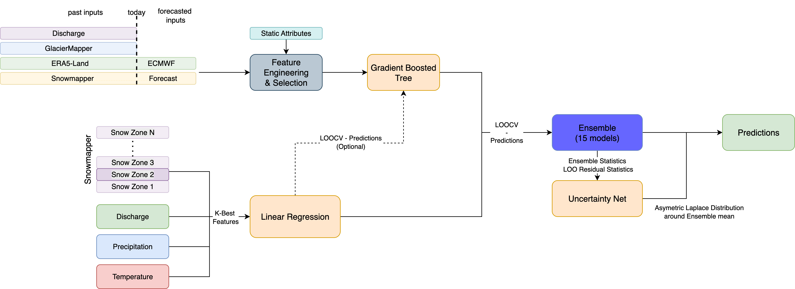

# Long Term Discharge Forecasting

A comprehensive machine learning system for predicting river discharge at long term (monthly to seasonal) timescales using ensemble methods and advanced feature engineering.

**Author**: Sandro Hunziker

## Maintenance Status

🟢 **Active** – Ongoing development as part of [SAPPHIRE Forecast Tools](https://github.com/hydrosolutions/sapphire-forecast-tools)

---
## Overview

The Long Term Discharge Forecasting System implements a modular pipeline that integrates multiple data sources, employs various machine learning algorithms, and uses ensemble techniques to produce robust discharge predictions. The system is designed for operational forecasting in Central Asian basins with complex hydrology influenced by snow and glacier dynamics. This code was develeoped in the context of the [SAPPHIRE project](https://www.hydrosolutions.ch/projects/sapphire-central-asia) and funded by the [Swiss Agency for Development and Cooperation](https://www.eda.admin.ch/eda/en/home/fdfa/organisation-fdfa/directorates-divisions/sdc.html). The code is the backbone of the machine learning based long-term forecasting component in the [SAPPHIRE Forecast Tools](https://github.com/hydrosolutions/SAPPHIRE_Forecast_Tools). Note that this repository is still work in progress.

### System Architecture



The diagram above illustrates the complete workflow from data ingestion to operational forecasts, including feature engineering, model training, and ensemble generation.

### Key Features

- **Multiple Model Families**: Linear regression baselines and gradient boosted tree-based models (XGBoost, LightGBM, CatBoost)
- **Advanced Feature Engineering**: Time-series features, elevation band aggregation, and glacier-related features
- **Ensemble Methods**: Naive averaging, temporal meta-models, and uncertainty quantification
- **Comprehensive Evaluation**: Interactive dashboards and extensive metrics
- **Modular Architecture**: Easy to extend with new models and data sources

## Documentation

### Core Documentation
- **[Model Descriptions](docs/model_description.md)** - Detailed model specifications and ensemble strategies
- **[Feature Engineering](docs/feature_engineering.md)** - Feature extraction and preprocessing pipelines
- **[Adding New Models](docs/how_to_add_model.md)** - Guide for implementing custom forecast models
- **[Development & Production Plan](docs/development_production_plan.md)** - Workflow for package integration

### Component Documentation
- [Data Processing](lt_forecasting/scr/documentation.md) - Data loading and feature engineering utilities
- [Model Implementations](lt_forecasting/forecast_models/documentation.md) - Individual model class details
- [Evaluation Pipeline](dev_tools/evaluation/README.md) - Metrics and evaluation workflows
- [Visualization Dashboard](dev_tools/visualization/README.md) - Interactive dashboard guide
- [Testing Guide](tests/README.md) - Test suite organization and best practices

## Quick Start

### Installation
For using it as a package (as in the SAPPHIRE Forecast Tools).
```bash
pip install git+https://github.com/hydrosolutions/long-term-forecasting.git@vX.X.X
```

### Prerequisites

- Python 3.11
- [uv](https://github.com/astral-sh/uv) package manager

### Installation

```bash
# Clone the repository
git clone [repository-url]
cd lt_forecasting

# Install uv if not already installed
pip install uv

# Install project dependencies
uv sync
```

### Basic Usage

```bash
# Run calibration and hindcast for a model
uv run python scripts/calibrate_hindcast.py --config_path example_config/DUMMY_MODEL

# Run hyperparameter tuning
uv run python scripts/tune_hyperparams.py --config_path example_config/DUMMY_MODEL

# Run complete evaluation pipeline
./run_evaluation_pipeline.sh

# Launch interactive dashboard
uv run python -m dev_tools.visualization.dashboard
```

## General Concept

The system follows a modular approach where different forecasting classes implement similar interfaces but handle different model types:

1. **LINEAR_REGRESSION**: Statistical baseline with period-specific models
2. **SciRegressor**: ML models (XGBoost, LightGBM, CatBoost)

This modular design enables:
- Efficient ensemble creation (process data once, train multiple models)
- Flexible feature combinations
- Easy addition of new model types

Example ensemble strategy:
- Models: XGBoost, LightGBM, CatBoost
- Feature sets: 
  - F₁ ∈ (Q, P, T)
  - F₂ ∈ (Q, T, P, Snow data)
  - F₃ ∈ (GlacierMapper, Q, T, P)
- Result: 9 different models that can be ensembled


## Project Structure

```
lt_forecasting/
├── lt_forecasting/        # Core production package
│   ├── __init__.py            # Package initialization
│   ├── scr/                   # Data processing and feature engineering
│   │   ├── data_loading.py    # Data ingestion and merging
│   │   ├── data_utils.py      # Preprocessing and transformations
│   │   ├── FeatureExtractor.py # Time-series feature engineering
│   │   ├── FeatureProcessingArtifacts.py  # Preprocessing state management
│   │   ├── sci_utils.py       # ML utilities
│   │   └── [documentation.md](lt_forecasting/scr/documentation.md)  # Component documentation
│   │
│   ├── forecast_models/       # Model implementations
│   │   ├── base_class.py      # Abstract base class for all models
│   │   ├── LINEAR_REGRESSION.py # Period-specific linear regression
│   │   ├── SciRegressor.py    # Tree-based models (XGB, LGBM, CatBoost)
│   │   └── [documentation.md](lt_forecasting/forecast_models/documentation.md)  # Model details
│   │
│   └── log_config.py          # Logging configuration
│
├── dev_tools/                 # Development-only tools
│   ├── eval_scr/              # Evaluation utilities
│   │   ├── metric_functions.py # Performance metrics (NSE, KGE, R², etc.)
│   │   ├── eval_helper.py     # Evaluation helper functions
│   │   └── [description.md](dev_tools/eval_scr/description.md)  # Metrics documentation
│   │
│   ├── evaluation/            # Evaluation pipeline
│   │   ├── evaluate_pipeline.py # Main evaluation orchestrator
│   │   ├── ensemble_builder.py # Ensemble creation and management
│   │   ├── prediction_loader.py # Load and process predictions
│   │   └── [README.md](dev_tools/evaluation/README.md)  # Pipeline documentation
│   │
│   └── visualization/         # Interactive dashboard and plotting
│       ├── dashboard.py       # Streamlit-based dashboard
│       ├── dashboard_components.py # UI components
│       ├── plotting_utils.py  # Visualization functions
│       └── [README.md](dev_tools/visualization/README.md)  # Dashboard guide
│
├── example_config/           # Configuration templates
│   ├── DUMMY_MODEL/         # Example configuration set
│   └── [description.md](example_config/description.md)  # Config guide
│
├── scripts/                 # Development scripts
│   ├── calibrate_hindcast.py    # Model training and prediction
│   └── tune_hyperparams.py      # Hyperparameter optimization
│
├── tests/                   # Comprehensive test suite
│   ├── unit/               # Unit tests for individual components
│   ├── functionality/      # Functionality and integration tests
│   ├── integration/        # Full integration tests
│   └── [README.md](tests/README.md)  # Testing guide
│
├── docs/                    # Project documentation
│   ├── [Overview.md](docs/Overview.md)  # System architecture
│   └── [model_description.md](docs/model_description.md)  # Model details
│
├── scratchpads/            # Development notes and planning
│   ├── issues/            # Issue-specific work
│   ├── planning/          # Feature planning
│   └── [README.md](scratchpads/README.md)  # Development workflow
│
├── setup.py                # Package installation script
├── pyproject.toml          # Project configuration
└── Shell Scripts:
    ├── calibration_script.sh         # Basic calibration
    ├── tune_and_calibrate_script.sh  # Tuning + calibration
    ├── run_evaluation_pipeline.sh    # Full evaluation
    └── run_model_workflow.sh         # Complete workflow
```

### Configuration Structure

Each model experiment requires a configuration directory with:
- `data_paths.json` - Input data file paths
- `experiment_config.json` - Experiment setup and basin selection
- `feature_config.json` - Feature engineering parameters
- `general_config.json` - Model and processing settings
- `model_config.json` - Algorithm-specific hyperparameters

See [example_config/](example_config/) for templates.


## Methodology

### Calibration & Validation Strategy

The system uses a robust validation approach:
- **Leave-One-Out Cross-Validation (LOO-CV)**: Applied to all years except the last 3
- **Hold-out Test Set**: Final 3 years reserved for unbiased evaluation
- **Meta-learning Assumption**: LOO-CV predictions represent model behavior on unseen data

### Model Families

#### 1. Linear Regression Models
- Period-specific models (36 periods = 3 per month)
- Features from discharge, precipitation, temperature
- Snow information from SnowMapper FSM (elevation zones)
- Serves as baseline and input for advanced models

#### 2. Tree-Based Models (SciRegressor)
- **Algorithms**: XGBoost, LightGBM, CatBoost, ... All models which support sklearn-style fit and predict funtions.
- **Extended Features**: 
  - All linear regression features
  - GlacierMapper data (SLA, FSC)
  - Linear regression predictions as meta-features
- **Advantages**: Captures non-linear relationships and interactions
- **Hyperparameter Tuning** Hyperparameter tuning using Optuna is implemented only for XGB, LGBM and Catboost. 

### Ensemble Strategies

1. **Naive Ensemble**: Simple average of all base predictors
2. **Uncertainty Quantification**: Asymmetric Laplace distribution for prediction intervals.
3. **Temporal Meta-Model**: Detects and corrects model drift using historical forecasts [not yet operationally tested]

## Output Formats

### Standard Predictions
```
predictions.csv:
date | Q_model1 | Q_model2 | Q_model3 | Q_model_name | valid_from | valid_to
```
model_name referes to the feature set used and Q_model_name is the mean of model_1 ... model_n.

### Predictions with Uncertainty
```
predictions_uncertainty.csv:
date | Q_05 | Q_10 | Q_50 | Q_90 | Q_95 | Q_mean | valid_from | valid_to
```


## Data Sources

The system integrates multiple data sources:

1. **Discharge Data**: Historical river discharge observations
2. **Forcing Data**: Temperature and precipitation
3. **Snow Data**: Snow water equivalent (SWE), height of snow (HS), runoff (ROF)
4. **Static Basin Characteristics**: Elevation, area, glacier coverage
5. **Remote Sensing Timeseries / New Features** New features can easily be added and passed to the classes in long dataframe format. 

## Feature Engineering

The system supports extensive feature engineering, all features are fully configurable in the feature_config.json:

### Time-Series Features
- Rolling window statistics (mean, slope, peak-to-peak)
- Multiple window sizes and lag periods
- Period-based features (36 periods = 3 per month)

### Spatial Features
- Elevation band aggregation (configurable zones)
- Basin-specific characteristics
- Glacier-related features from GlacierMapper

### Normalization Options
- Global normalization
- Per-basin normalization
- Long-term mean scaling (period-based)


## Advanced Usage

### Running Complete Workflows

```bash
# Full model workflow (tuning + calibration + evaluation)
./run_model_workflow.sh

# Hyperparameter tuning followed by calibration
./tune_and_calibrate_script.sh

# Evaluation pipeline for multiple models
./run_evaluation_pipeline.sh

# Basic calibration only
./calibration_script.sh
```

### Dashboard Usage

```bash
# Launch interactive dashboard
uv run python visualization/dashboard.py

# Dashboard will be available at http://localhost:8501
```

### Creating Custom Configurations

1. Copy the example configuration:
   ```bash
   cp -r example_config/DUMMY_MODEL example_config/MY_MODEL
   ```

2. Edit configuration files according to your needs:
   - Update data paths in `data_paths.json`
   - Select basins in `experiment_config.json`
   - Configure features in `feature_config.json`
   - Set model parameters in `model_config.json`

## Development

### Running Tests

```bash
# Run all tests
uv run pytest -v

# Run specific test file
uv run pytest tests/test_linear_regression.py -v

# Run with coverage
uv run pytest --cov=. --cov-report=html
```

### Code Quality

```bash
# Format code with ruff
uv run ruff format

# Check code style
uv run ruff check

```

### Development Workflow

1. Create a scratchpad for complex features:
   ```bash
   touch scratchpads/planning/my-feature.md
   ```

2. Use the scratchpad template (see [scratchpads/README.md](scratchpads/README.md))

3. Follow test-driven development practices

4. Document architectural decisions


## Contact

Sandro Hunziker - hunziker@hydrosolutions.ch


