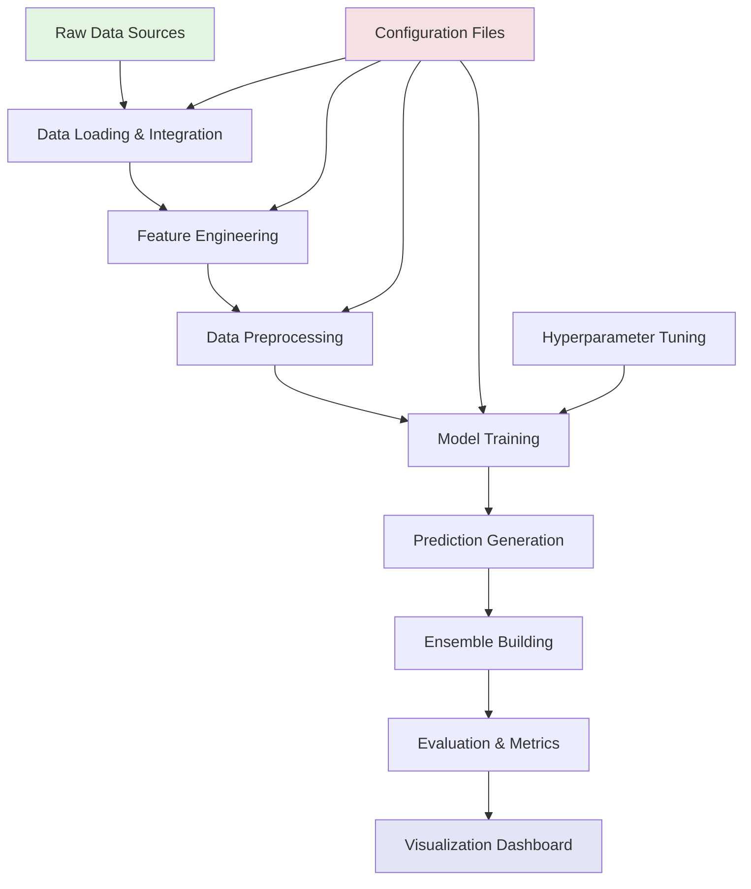
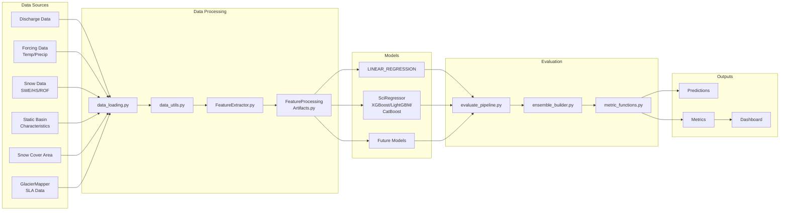

# Monthly Discharge Forecasting System - Overview

## System Architecture

The Monthly Discharge Forecasting System is a comprehensive machine learning pipeline designed to predict river discharge at monthly timescales using various environmental features including temperature, precipitation, snow data, and glacier characteristics.

## High-Level Workflow



## Detailed Component Flow



## Key System Features

### 1. Modular Architecture
- **Clear Separation of Concerns**: Each component has a specific responsibility
- **Extensible Design**: Easy to add new models, features, or data sources
- **Configuration-Driven**: Behavior controlled through JSON configuration files

### 2. Advanced Feature Engineering
- **Multi-Scale Temporal Features**: Rolling windows with various statistical operations
- **Elevation Band Processing**: Configurable number of elevation zones
- **Glacier Features**: Integration with GlacierMapper for snow line altitude
- **Period-Based Scaling**: 36 periods (3 per month) for capturing sub-monthly patterns

### 3. Multiple Normalization Strategies
- **Global Normalization**: Across all basins and time
- **Per-Basin Normalization**: Basin-specific scaling
- **Long-Term Mean Scaling**: Relative to historical periods
- **Mixed Strategies**: Combine different approaches

### 4. Ensemble Modeling
- **Model Diversity**: Linear regression, tree-based models (XGBoost, LightGBM, CatBoost)
- **Family Ensembles**: Combine models of the same type
- **Global Ensembles**: Combine all available models
- **Flexible Aggregation**: Mean, median, weighted approaches

### 5. Comprehensive Evaluation
- **Multiple Metrics**: R², NSE, KGE, RMSE, MAE, Bias, Correlation
- **Cross-Validation**: Leave-One-Year-Out (LOOCV) approach
- **Basin-Specific Analysis**: Performance breakdown by catchment
- **Temporal Analysis**: Performance across different seasons/periods

## Data Flow Details

### 1. Input Data Processing
```
Raw Files → data_loading.load_data() → Merged DataFrame
                    ↓
            Quality Checks
                    ↓
            Missing Data Handling
                    ↓
            Initial Transformations
```

### 2. Feature Engineering Pipeline
```
Merged Data → FeatureExtractor → Rolling Window Features
                    ↓
            Elevation Band Features
                    ↓
            Glacier Features
                    ↓
            Temporal Features
                    ↓
            Complete Feature Set
```

### 3. Model Training Workflow
```
Features → Train/Test Split → Preprocessing → Model Training
                                    ↓              ↓
                              Artifacts      Predictions
                                    ↓              ↓
                              Saved for    Evaluation
                              Production
```

## Configuration Management

The system uses a hierarchical configuration structure:

1. **data_paths.json**: File paths for all input data
2. **experiment_config.json**: Experiment setup and basin selection
3. **feature_config.json**: Feature engineering parameters
4. **general_config.json**: Overall system settings
5. **model_config.json**: Algorithm-specific hyperparameters

## Production Deployment

### Operational Forecasting Mode
```python
# Load trained model and artifacts
model = load_model("path/to/saved/model")
artifacts = load_artifacts("path/to/artifacts")

# Process new data
new_features = process_operational_data(new_data, artifacts)

# Generate forecast
forecast = model.predict_operational(new_features)
```

### Key Production Features
- **Artifact Persistence**: Preprocessing state saved for consistency
- **Model Versioning**: Track model versions and configurations
- **Logging System**: Comprehensive logging for debugging
- **Error Handling**: Graceful degradation and informative error messages

## System Requirements

### Software Dependencies
- Python 3.8+
- Scientific Computing: numpy, pandas, scikit-learn
- ML Libraries: xgboost, lightgbm, catboost
- Optimization: optuna
- Visualization: plotly, dash
- Data Processing: geopandas, xarray

### Hardware Recommendations
- **Memory**: 16GB+ RAM for large basin sets
- **Storage**: 50GB+ for data and model artifacts
- **CPU**: Multi-core processor for parallel processing
- **GPU**: Optional, beneficial for tree-based models

## Development Workflow

1. **Configuration Setup**: Define experiment parameters
2. **Data Preparation**: Load and validate input data
3. **Feature Engineering**: Create relevant features
4. **Model Training**: Train individual models
5. **Hyperparameter Tuning**: Optimize model parameters
6. **Ensemble Creation**: Combine model predictions
7. **Evaluation**: Assess performance
8. **Visualization**: Analyze results in dashboard

## Best Practices

1. **Version Control**: Track configurations and code changes
2. **Testing**: Run test suite before major changes
3. **Documentation**: Update docs when adding features
4. **Reproducibility**: Use fixed random seeds
5. **Monitoring**: Check logs for anomalies
6. **Validation**: Verify data quality at each step

## Future Enhancements

- Real-time data integration
- Uncertainty quantification
- Automated model selection
- Cloud deployment options
- API for external access
- Extended forecast horizons