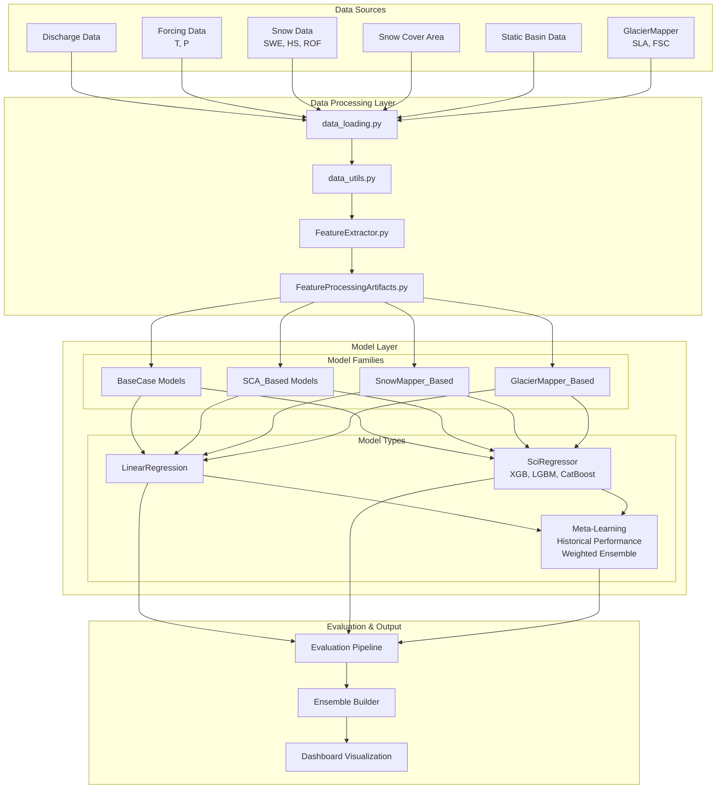
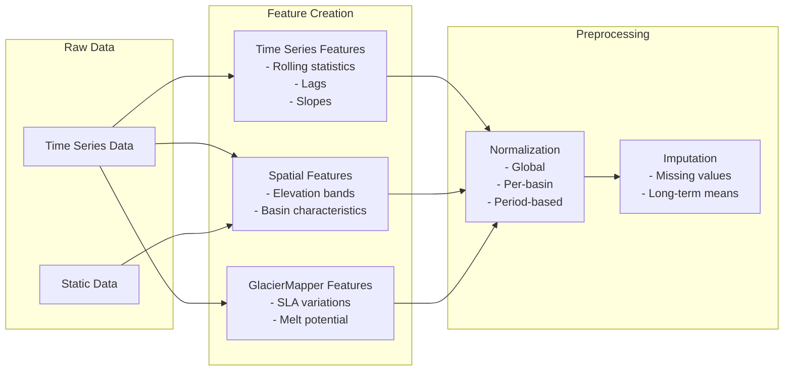
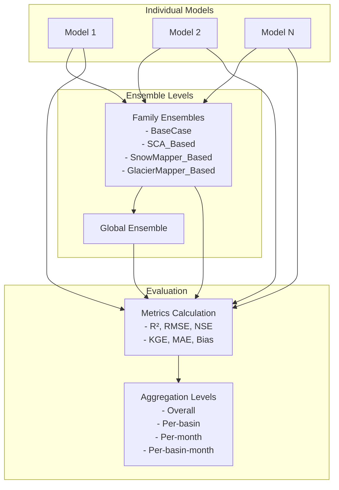
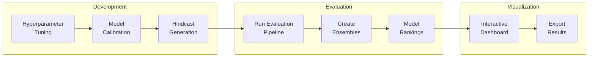

# Monthly Discharge Forecasting System Overview

## Table of Contents
1. [System Architecture](#system-architecture)
2. [Data Flow](#data-flow)
3. [Core Components](#core-components)
4. [Model Families](#model-families)
5. [Workflow Overview](#workflow-overview)
6. [Recent Developments](#recent-developments)
7. [Integration Guide](#integration-guide)

## System Architecture

The Monthly Discharge Forecasting System is a comprehensive machine learning pipeline designed to predict river discharge at monthly timescales. The system employs a modular architecture that enables:

- Multiple model families with different approaches
- Advanced feature engineering from diverse data sources
- Ensemble methods for robust predictions
- Comprehensive evaluation and visualization

### High-Level Architecture Diagram



## Data Flow

### 1. Data Ingestion
The system integrates multiple data sources through `scr/data_loading.py`:

- **Discharge Data**: Historical river discharge observations (m³/s)
- **Forcing Data**: Temperature (°C) and precipitation (mm)
- **Snow Data**: 
  - SWE (Snow Water Equivalent)
  - HS (Height of Snow)
  - ROF (Runoff)
- **Snow Cover Area (SCA)**: Satellite-based snow coverage percentages
- **Static Basin Characteristics**: Elevation range, area, glacier fraction
- **GlacierMapper Data**: Snow line altitude (SLA), fractional snow cover (FSC)

### 2. Feature Engineering Pipeline



### 3. Model Training & Prediction

The system supports two main model types:

#### LinearRegression Models
- Period-specific models (6 periods per month)
- Dynamic feature selection based on correlation
- Leave-one-year-out cross-validation

#### SciRegressor Models
- Global models trained on all basins
- Ensemble methods: XGBoost, LightGBM, CatBoost
- Advanced hyperparameter optimization with Optuna

#### Meta-Learning Models
- Historical performance-weighted ensemble framework
- Intelligently combines predictions from multiple base models
- Learns from historical performance patterns per basin and period
- Provides robust fallback mechanisms for insufficient data

### 4. Evaluation & Ensemble Creation



## Core Components

### 1. SCR Module (`scr/`)
Core utilities for data processing and feature engineering:

- **data_loading.py**: Unified data loading interface
- **data_utils.py**: Preprocessing, normalization, elevation band processing
- **FeatureExtractor.py**: Time series feature engineering
- **FeatureProcessingArtifacts.py**: Preprocessing state management
- **sci_utils.py**: Machine learning utilities
- **meta_utils.py**: Utility functions for meta-learning workflows
- **metrics.py**: Evaluation metrics for model performance assessment

### 2. Forecast Models (`forecast_models/`)
Model implementations following a common interface:

- **base_class.py**: Abstract base class defining the interface
- **LINEAR_REGRESSION.py**: Statistical baseline models
- **SciRegressor.py**: Tree-based ensemble models
- **meta_learners/**: Meta-learning framework for intelligent ensemble creation
  - **base_meta_learner.py**: Abstract base class for meta-learning models
  - **historical_meta_learner.py**: Historical performance-weighted meta-learning

### 3. Evaluation (`evaluation/`)
Comprehensive evaluation pipeline:

- **evaluate_pipeline.py**: Main orchestrator
- **prediction_loader.py**: Loads model predictions
- **ensemble_builder.py**: Creates family and global ensembles
- **evaluate_models.py**: Calculates performance metrics

### 4. Visualization (`visualization/`)
Interactive dashboard for model comparison:

- **dashboard.py**: Main Dash application
- **data_handlers.py**: Data management for visualization
- **plotting_utils.py**: Consistent styling and color schemes
- **dashboard_components.py**: Reusable UI components

## Model Families

The system organizes models into families based on their input features:

### 1. BaseCase Models
- Basic features: discharge (Q), temperature (T), precipitation (P)
- Examples: LR_Q_T_P, PerBasinScalingLR, ShortTermLR

### 2. SCA_Based Models
- Incorporate Snow Cover Area data
- Examples: LR_Q_SCA, LR_Q_T_SCA

### 3. SnowMapper_Based Models
- Use detailed snow data (SWE, HS, ROF)
- Support multiple elevation zones
- Examples: Various configurations with elevation band features

### 4. GlacierMapper_Based Models
- Leverage GlacierMapper features (SLA, FSC)
- Include glacier melt potential calculations
- Examples: NormBased, Correction, MiniCorrection

## Workflow Overview

### Complete Model Development Workflow



### Key Scripts

1. **tune_hyperparams.py**: Optimize model hyperparameters
2. **calibrate_hindcast.py**: Train models and generate historical predictions
3. **evaluate_pipeline.py**: Run comprehensive evaluation
4. **dashboard.py**: Launch interactive visualization

### Shell Scripts for Automation

- `tune_and_calibrate_script.sh`: Combined tuning and calibration
- `run_evaluation_pipeline.sh`: Execute evaluation pipeline
- `run_model_workflow.sh`: Complete end-to-end workflow

## Recent Developments

### 1. GlacierMapper Integration
- Added support for snow line altitude (SLA) features
- Integrated fractional snow cover (FSC) data
- Implemented glacier melt potential calculations
- Created specialized GlacierMapper_Based model family

### 2. Enhanced Elevation Zone Support
- Configurable number of elevation bands (not fixed to 5)
- Percentile-based elevation band calculation
- Improved snow data aggregation by elevation

### 3. Period-Based Temporal Grouping
- Implemented 36 annual periods (3 per month)
- Period-specific normalization and scaling
- Improved handling of seasonal patterns

### 4. Dashboard Improvements
- Interactive model comparison across metrics
- Basin-specific performance analysis
- Monthly performance heatmaps
- Export functionality for further analysis

### 5. Meta-Learning Framework
- Implemented historical performance-weighted meta-learning
- Intelligent ensemble creation based on basin-period specific performance
- Softmax weighting strategy with configurable temperature
- Fallback mechanisms for insufficient historical data
- Complete LOOCV training pipeline for robust model training

## Integration Guide

### Adding a New Data Source

1. Update `scr/data_loading.py` to load the new data
2. Add preprocessing in `scr/data_utils.py` if needed
3. Configure features in `FeatureExtractor.py`
4. Update model configurations to use new features

### Adding a New Model Type

1. Create a new class inheriting from `BaseForecastModel`
2. Implement required methods:
   - `calibrate_model_and_hindcast()`
   - `predict_operational()`
   - `save_model()` / `load_model()`
3. Add model to appropriate family in evaluation pipeline
4. Update configuration templates

### Running a Complete Experiment

```bash
# 1. Prepare configuration files
cp -r example_config/DUMMY_MODEL example_config/MY_EXPERIMENT

# 2. Edit configuration files
# Update data_paths.json, general_config.json, etc.

# 3. Run hyperparameter tuning (optional)
uv run tune_hyperparams.py --config_path example_config/MY_EXPERIMENT

# 4. Calibrate and generate hindcasts
uv run calibrate_hindcast.py --config_path example_config/MY_EXPERIMENT

# 5. Run evaluation pipeline
./run_evaluation_pipeline.sh

# 6. Launch dashboard
uv run python visualization/dashboard.py
```

## Best Practices

1. **Feature Engineering**: Use `StreamflowFeatureExtractor` for consistent feature creation
2. **Preprocessing**: Always save and reuse `FeatureProcessingArtifacts`
3. **Model Organization**: Place models in appropriate families for ensemble creation
4. **Evaluation**: Use the standard evaluation pipeline for comparable results
5. **Documentation**: Update model descriptions when adding new approaches

## Future Directions

- Integration of additional Earth observation data sources
- Development of uncertainty quantification methods
- Implementation of online learning capabilities
- Extension to sub-monthly forecast horizons
- Enhanced ensemble weighting strategies