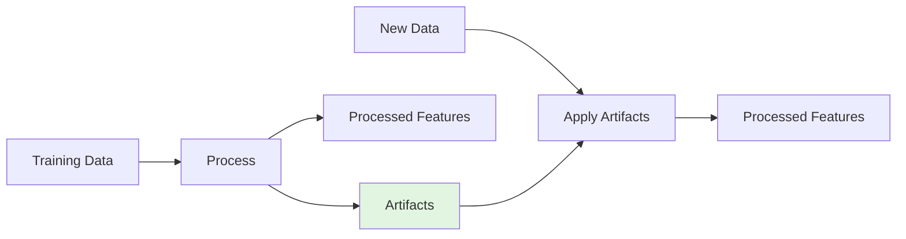

# Feature Engineering - Monthly Discharge Forecasting

This document provides a comprehensive guide to the feature engineering pipeline, covering feature extraction, preprocessing, and the artifact management system.

## Overview

The feature engineering system transforms raw hydrological data into informative features for machine learning models. It consists of two main components:

1. **StreamflowFeatureExtractor** (`FeatureExtractor.py`) - Extracts time-series features from raw data
2. **FeatureProcessingArtifacts** (`FeatureProcessingArtifacts.py`) - Manages preprocessing artifacts (imputation, scaling, feature selection)

## StreamflowFeatureExtractor

**Location**: `lt_forecasting/scr/FeatureExtractor.py`

### Purpose

Generates time-series features from discharge, weather, and snow data using rolling windows, lags, and statistical transformations.

### Key Concepts

#### Prediction Horizon and Offset

```python
feature_extractor = StreamflowFeatureExtractor(
    feature_configs=config,
    prediction_horizon=30,  # Predict 30-day average
    offset=30               # Gap between features and target
)
```

- **Prediction Horizon**: Number of days ahead to predict (e.g., 30 days)
- **Offset**: Time gap between last feature and target start (default = prediction_horizon)
- **Constraint**: `offset >= prediction_horizon` (ensures no future information leakage)

**Example Timeline**:
```
Current Date: Day 0
├─ Features: Day -90 to Day 0 (historical data)
├─ Offset: Day 0 to Day 30 (no features used from this period)
└─ Target: Day 30 to Day 60 (30-day average discharge to predict)
```

### Feature Types

#### 1. Rolling Window Features

Computed over configurable time windows (e.g., 7, 14, 30, 60, 90 days):

**Statistical Features**:
- `mean`: Average value over window
- `std`: Standard deviation
- `min`: Minimum value
- `max`: Maximum value
- `median`: Median value

**Advanced Time-Series Features**:
- `slope`: Linear trend (first-order polynomial coefficient)
- `pk_pk_distance`: Peak-to-peak range (max - min)
- `mean_difference`: Average change between consecutive values
- `median_abs_deviation`: Robust measure of variability
- `last_value`: Most recent value in window
- `time_distance_from_peak`: Days since maximum value
- `relativ_deviation_from_peak`: Relative distance from peak: `(peak - last) / peak`
- `time_of_occurrence_last_value`: Recency of last valid observation
- `increasing_in_projection`: Trend indicator (-1, 0, 1)

**Implementation Details**:
```python
def rolling_slope(x):
    """Calculate linear trend coefficient over rolling window."""
    x_non_nan = x[~np.isnan(x)]
    if len(x_non_nan) < 2:
        return np.nan
    x_values = np.arange(len(x_non_nan))
    return np.polyfit(x_values, x_non_nan, 1)[0]  # Returns slope
```

#### 2. Lag Features

Simple temporal shifts of variables:

```python
Q_lag_7d    # Discharge 7 days ago
P_lag_30d   # Precipitation 30 days ago
T_lag_14d   # Temperature 14 days ago
```

#### 3. Time-Based Features

Cyclic encoding of temporal patterns:

```python
day_of_year_sin = np.sin(2 * π * day_of_year / 365.25)
day_of_year_cos = np.cos(2 * π * day_of_year / 365.25)
```

**Advantages**:
- Captures seasonal patterns
- Maintains continuity (Dec 31 → Jan 1)
- Enables model to learn periodic behavior

#### 4. Elevation Band Features

For snow and precipitation data aggregated across elevation zones:

```python
# Example: 5 elevation bands
P_zone_1_mean_30d   # Precipitation in lowest elevation zone
P_zone_5_mean_30d   # Precipitation in highest elevation zone
SWE_zone_3_max_60d  # Max snow water equivalent in mid-elevation
```

**Configuration**:
```json
{
    "n_elevation_zones": 5,
    "variables": ["P", "T", "SWE", "HS", "ROF"],
    "rolling_windows": [7, 14, 30, 60, 90]
}
```

#### 5. Static Basin Features

Time-invariant characteristics:

- `basin_area`: Catchment area (km²)
- `lat`, `lon`: Geographic coordinates
- `mean_elevation`: Average elevation (m)
- `glacier_fraction`: Fraction of basin covered by glaciers
- `aridity_index`: Climate classification metric
- `aspect_ratio`: Basin shape characteristic

### Feature Configuration

Feature generation is controlled via `feature_config.json`:

```json
{
    "discharge": {
        "rolling_windows": [7, 14, 30, 60, 90],
        "statistics": ["mean", "std", "slope", "pk_pk_distance"],
        "lags": [1, 7, 14, 30]
    },
    "precipitation": {
        "rolling_windows": [30, 60, 90],
        "statistics": ["mean", "sum"],
        "elevation_zones": true,
        "n_zones": 5
    },
    "temperature": {
        "rolling_windows": [7, 14, 30],
        "statistics": ["mean", "min", "max"]
    },
    "snow": {
        "variables": ["SWE", "HS", "ROF"],
        "rolling_windows": [7, 14, 30, 60],
        "statistics": ["mean", "max"],
        "elevation_zones": true
    },
    "glacier_mapper": {
        "enabled": true,
        "variables": ["SLA", "FSC"],
        "lags": [0, 10, 20, 30]
    }
}
```

### Target Variable Creation

The `create_target()` method generates the prediction target:

```python
# For prediction_horizon = 30:
# Average discharge from Day offset to Day offset+30
target = discharge[offset:offset+30].mean()
```

**Key Properties**:
- Uses future data relative to features (proper temporal separation)
- Aggregates to match forecast period (daily → monthly)
- Handles missing data gracefully

### Main Methods

#### `create_all_features(data)`

Master method that orchestrates feature generation:

1. Extract rolling window features for all variables
2. Create lagged features
3. Generate time-based features
4. Combine elevation band features
5. Return feature matrix aligned with target

#### `get_feature_names()`

Returns list of generated feature names for debugging and analysis.

---

## FeatureProcessingArtifacts

**Location**: `lt_forecasting/scr/FeatureProcessingArtifacts.py`

### Purpose

Manages the complete preprocessing pipeline and stores all artifacts needed to reproduce the same transformations in production.

### The Artifact System

**Problem**: ML models require consistent preprocessing between training and production.

**Solution**: Store all preprocessing objects (scalers, imputers, feature selectors) in a single, portable artifact.



### Key Components

#### 1. Imputation

Handles missing values in features:

```python
imputer: SimpleImputer
```

**Strategies**:
- `mean`: Replace NaN with feature mean (default for numerical)
- `median`: More robust to outliers
- `constant`: Fill with specified value (e.g., 0)

**Important**: Imputation parameters fitted on training data, applied identically to test/production data.

#### 2. Scaling/Normalization

Normalizes feature distributions:

```python
scaler: StandardScaler | MinMaxScaler | RobustScaler
static_scaler: Separate scaler for static features
```

**Scaling Options**:

- **StandardScaler**: Z-score normalization
  ```
  X_scaled = (X - μ) / σ
  ```

- **MinMaxScaler**: Scale to [0, 1]
  ```
  X_scaled = (X - X_min) / (X_max - X_min)
  ```

- **RobustScaler**: Use median and IQR (robust to outliers)
  ```
  X_scaled = (X - median) / IQR
  ```

**Period-Based Scaling**:

For seasonality-aware normalization:

```python
long_term_means: Dict[period, pd.Series]
long_term_stats: Dict[period, Dict[stat, pd.Series]]
```

Example:
```python
# Period 1 (early January): μ_Q = 50 m³/s, σ_Q = 10
# Period 18 (June): μ_Q = 200 m³/s, σ_Q = 40

# Normalize discharge relative to period-specific statistics
Q_normalized_period_1 = (Q - 50) / 10
Q_normalized_period_18 = (Q - 200) / 40
```

**Benefits**:
- Accounts for seasonal discharge patterns
- Improves model performance on highly seasonal data
- 36 periods = 3 per month (10-day resolution)

#### 3. Feature Selection

Reduces dimensionality and multicollinearity:

```python
feature_selector: SelectKBest | VarianceThreshold
selected_features: List[str]
highly_correlated_features: Set[str]
final_features: List[str]
```

**Selection Strategies**:

1. **Variance Threshold**: Remove low-variance features
   ```python
   # Remove features with variance < threshold
   selector = VarianceThreshold(threshold=0.01)
   ```

2. **Univariate Selection**: Statistical tests (F-test, mutual information)
   ```python
   selector = SelectKBest(f_regression, k=50)
   ```

3. **Correlation Filtering**: Remove highly correlated features
   ```python
   # If corr(feature_i, feature_j) > 0.95, remove one
   highly_correlated_features = find_correlated_pairs(threshold=0.95)
   ```

#### 4. Metadata

Tracking information for reproducibility:

```python
creation_timestamp: datetime
experiment_config_hash: str
feature_count: int
target_col: str
```

### Main Functions

#### `process_training_data(df, target_col, config)`

Processes training data and creates artifacts:

```python
artifacts, X_processed, y = process_training_data(
    df=training_data,
    target_col='Q_target',
    config=general_config
)
```

**Steps**:
1. Handle missing values (fit imputer)
2. Apply feature selection (fit selector)
3. Scale features (fit scaler)
4. Store all fitted objects in artifacts
5. Return processed features and artifacts

#### `save_artifacts_for_production(artifacts, path, format='hybrid')`

Saves artifacts to disk:

```python
save_artifacts_for_production(
    artifacts=artifacts,
    path='models/XGB_basecase/',
    format='hybrid'  # or 'joblib', 'pickle'
)
```

**Save Formats**:

- `joblib`: Fast, optimized for NumPy arrays (recommended)
- `pickle`: Python standard, more portable
- `hybrid`: Uses safe JSON/CSV serialization for critical objects

**Files Created**:
```
models/XGB_basecase/
├── artifacts.joblib              # Main artifacts file
├── scaler_parameters.json        # Scaler params (hybrid mode)
├── long_term_means_period_*.csv  # Period stats (hybrid mode)
└── metadata.json                 # Experiment info
```

#### `load_artifacts_for_production(path)`

Loads artifacts from disk:

```python
artifacts = load_artifacts_for_production('models/XGB_basecase/')
```

**Features**:
- Auto-detects save format
- Validates artifact integrity
- Provides informative error messages

#### `process_test_data(df, artifacts)`

Applies training artifacts to new data:

```python
X_processed = process_test_data(
    df=operational_data,
    artifacts=artifacts
)
```

**Steps**:
1. Apply imputation (using training parameters)
2. Select features (using training selection)
3. Scale features (using training statistics)
4. Return processed features in identical format

**Critical**: No fitting happens here - only transformation!

#### `post_process_predictions(predictions, artifacts, period)`

Inverse transforms predictions back to original scale:

```python
Q_original_scale = post_process_predictions(
    predictions=model_output,
    artifacts=artifacts,
    period=18  # June period
)
```

### Persistence Strategies

#### Standard Mode (joblib/pickle)

**Advantages**:
- Simple, single-file storage
- Fast serialization/deserialization
- Works well for most use cases

**Limitations**:
- Version compatibility issues across Python/library versions
- Opaque binary format (hard to debug)

#### Hybrid Mode (Recommended for Production)

**Advantages**:
- Human-readable formats (JSON, CSV) for critical components
- More robust across environments
- Easier debugging and validation
- Better version control

**Trade-offs**:
- Slightly larger file sizes
- Marginally slower load times

**Example Hybrid Serialization**:
```python
# Scaler parameters saved as JSON
{
    "mean_": [0.5, 1.2, -0.3],
    "scale_": [0.8, 1.1, 0.9],
    "feature_names": ["Q_mean_30d", "P_sum_60d", "T_mean_14d"]
}

# Long-term means saved as CSV
period,Q_mean_30d,P_sum_60d,T_mean_14d
1,45.2,120.5,2.3
2,48.1,115.8,3.1
...
```

## Configuration

### Feature Config Example

```json
{
    "feature_engineering": {
        "imputation": {
            "strategy": "mean",
            "missing_threshold": 0.5
        },
        "scaling": {
            "method": "standard",
            "per_basin": true,
            "use_long_term_mean": true,
            "n_periods": 36
        },
        "feature_selection": {
            "enabled": true,
            "method": "variance_threshold",
            "variance_threshold": 0.01,
            "correlation_threshold": 0.95
        }
    },
    "relative_scaling": {
        "enabled": true,
        "variables": ["Q", "P", "SWE"],
        "scale_target": true
    }
}
```

## Best Practices

### 1. Feature Engineering

✅ **DO**:
- Use domain knowledge to select meaningful windows (e.g., 60-90 days for snow accumulation)
- Include multiple time scales (short-term: 7d, medium: 30d, long-term: 90d)
- Apply temporal validation (features before target)
- Use cyclic encoding for time features

❌ **DON'T**:
- Create features from future data (data leakage!)
- Generate excessive features without selection (curse of dimensionality)
- Ignore missing data patterns (may be informative)

### 2. Preprocessing Artifacts

✅ **DO**:
- Always save artifacts after training
- Use hybrid mode for production deployments
- Validate artifacts load correctly before deployment
- Version artifacts with model checkpoints

❌ **DON'T**:
- Fit preprocessing on test/production data
- Mix training and test data for scaling
- Modify artifacts manually (use code)

### 3. Scaling Strategies

**When to use period-based scaling**:
- Highly seasonal discharge (>3x variance across year)
- Strong monthly patterns in hydrology
- Basin with distinct snow/glacier melt seasons

**When to use global scaling**:
- Year-round rainfall-dominated basins
- Small seasonal variation
- Limited training data

### 4. Feature Selection

**Guidelines**:
- Start with all features, then select
- Use correlation threshold ~0.95 (avoid perfect multicollinearity)
- Monitor feature importance after training
- Re-evaluate features when adding new data sources

## Workflow Example

### Training Phase

```python
from lt_forecasting.scr.FeatureExtractor import StreamflowFeatureExtractor
from lt_forecasting.scr.FeatureProcessingArtifacts import (
    process_training_data,
    save_artifacts_for_production
)

# 1. Extract features
extractor = StreamflowFeatureExtractor(
    feature_configs=feature_config,
    prediction_horizon=30,
    offset=30
)

df_features = extractor.create_all_features(data=discharge_data)
target = extractor.create_target(data=discharge_data)

# 2. Process and create artifacts
artifacts, X_train, y_train = process_training_data(
    df=df_features,
    target_col='Q_target',
    config=general_config
)

# 3. Train model
model.fit(X_train, y_train)

# 4. Save everything
model.save('models/my_model/')
save_artifacts_for_production(
    artifacts=artifacts,
    path='models/my_model/',
    format='hybrid'
)
```

### Operational Phase

```python
from lt_forecasting.scr.FeatureProcessingArtifacts import (
    load_artifacts_for_production,
    process_test_data,
    post_process_predictions
)

# 1. Load artifacts
artifacts = load_artifacts_for_production('models/my_model/')

# 2. Extract features from new data
extractor = StreamflowFeatureExtractor(
    feature_configs=feature_config,
    prediction_horizon=30,
    offset=30
)
df_features = extractor.create_all_features(data=new_data)

# 3. Apply preprocessing
X_operational = process_test_data(
    df=df_features,
    artifacts=artifacts
)

# 4. Make prediction
predictions_scaled = model.predict(X_operational)

# 5. Transform back to original scale
predictions = post_process_predictions(
    predictions=predictions_scaled,
    artifacts=artifacts,
    period=current_period
)
```

## Debugging and Validation

### Check Feature Names

```python
extractor = StreamflowFeatureExtractor(config, 30, 30)
feature_names = extractor.get_feature_names()
print(f"Total features: {len(feature_names)}")
print(feature_names[:10])  # First 10 features
```

### Inspect Artifacts

```python
artifacts = load_artifacts_for_production('models/my_model/')
info = artifacts.get_info()
print(info)
# Output:
# {
#     'feature_count': 142,
#     'selected_features': 85,
#     'creation_timestamp': '2024-01-15 10:30:00',
#     'scaling_method': 'standard_per_period',
#     ...
# }
```

### Validate Scaling

```python
# Training data statistics
print("Training mean:", X_train.mean(axis=0))
print("Training std:", X_train.std(axis=0))

# After scaling
X_scaled = artifacts.scaler.transform(X_train)
print("Scaled mean:", X_scaled.mean(axis=0))  # Should be ~0
print("Scaled std:", X_scaled.std(axis=0))    # Should be ~1
```

## Common Issues and Solutions

### Issue: Features contain NaN after processing

**Cause**: Insufficient historical data or imputation failure

**Solution**:
```python
# Check missing data before processing
print(df.isnull().sum())

# Adjust imputation strategy
config['imputation']['strategy'] = 'median'  # More robust
```

### Issue: Predictions in wrong scale

**Cause**: Forgot to inverse transform predictions

**Solution**:
```python
# Always use post_process_predictions
predictions = post_process_predictions(
    predictions=model_output,
    artifacts=artifacts,
    period=current_period
)
```

### Issue: Artifact loading fails after library update

**Cause**: Joblib version incompatibility

**Solution**:
```python
# Use hybrid format for better compatibility
save_artifacts_for_production(
    artifacts=artifacts,
    path='models/my_model/',
    format='hybrid'
)
```

### Issue: Feature count mismatch between training and production

**Cause**: Different feature configuration or data availability

**Solution**:
```python
# Validate feature consistency
assert len(X_prod.columns) == artifacts.feature_count, (
    f"Expected {artifacts.feature_count} features, got {len(X_prod.columns)}"
)
```

## References

- **StreamflowFeatureExtractor**: `lt_forecasting/scr/FeatureExtractor.py`
- **FeatureProcessingArtifacts**: `lt_forecasting/scr/FeatureProcessingArtifacts.py`
- **Configuration Examples**: `example_config/DUMMY_MODEL/feature_config.json`
- **Usage Examples**: `scripts/calibrate_hindcast.py`
