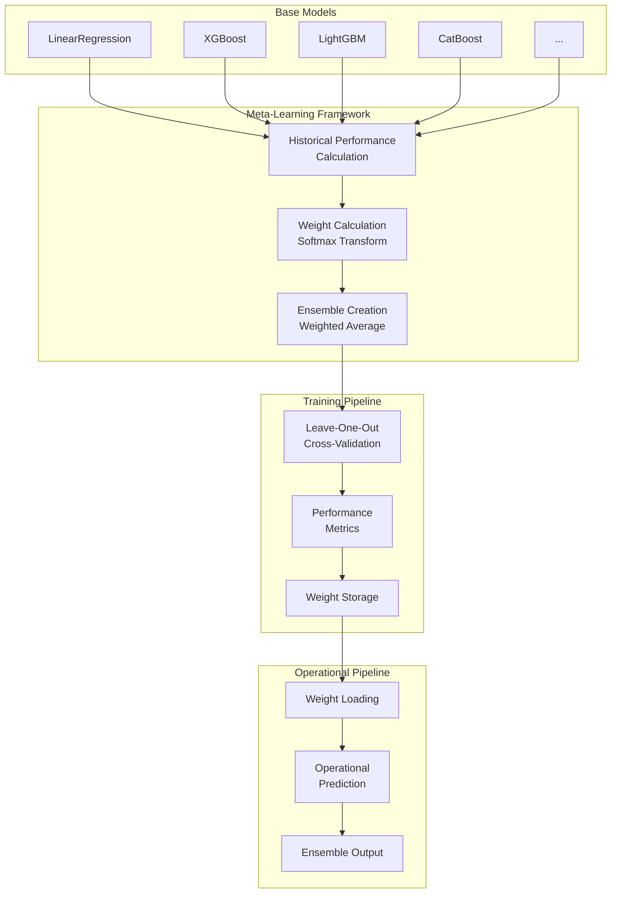

# Meta-Learning Framework for Monthly Discharge Forecasting

## Overview

The meta-learning framework provides an intelligent ensemble approach for combining predictions from multiple base models by learning from historical performance patterns. The framework weights base model predictions based on their historical performance for specific basin-period combinations, creating more robust and accurate forecasts.

## Table of Contents

1. [Architecture](#architecture)
2. [Key Components](#key-components)
3. [Core Concepts](#core-concepts)
4. [Implementation Details](#implementation-details)
5. [Configuration](#configuration)
6. [Usage Examples](#usage-examples)
7. [Performance Evaluation](#performance-evaluation)
8. [Best Practices](#best-practices)
9. [Troubleshooting](#troubleshooting)

## Architecture

### High-Level Architecture



## Key Components

### 1. BaseMetaLearner (`base_meta_learner.py`)

Abstract base class that provides common functionality for all meta-learning models:

- **Base Predictor Loading**: Loads predictions from multiple pre-trained models
- **Historical Performance Calculation**: Computes performance metrics per basin-period
- **Common Interface**: Ensures consistency across different meta-learning approaches

### 2. HistoricalMetaLearner (`historical_meta_learner.py`)

Concrete implementation that weights base models based on historical performance:

- **Performance-Based Weighting**: Uses historical performance to determine model weights
- **Softmax Transformation**: Converts performance metrics to normalized weights
- **Fallback Mechanisms**: Handles insufficient data with global performance metrics

### 3. Meta-Learning Utilities (`meta_utils.py`)

Utility functions supporting meta-learning workflows:

- **Weight Calculation**: Softmax and normalized weight calculation methods
- **Ensemble Creation**: Weighted averaging of base model predictions
- **Data Validation**: Checks for data sufficiency and quality
- **Performance Aggregation**: Aggregates metrics across basins and periods

### 4. Performance Metrics (`metrics.py`)

Comprehensive evaluation metrics for model performance assessment:

- **Nash-Sutcliffe Efficiency (NSE)**
- **Coefficient of Determination (R²)**
- **Root Mean Square Error (RMSE)**
- **Mean Absolute Error (MAE)**
- **Normalized variants (NMSE, NRMSE, NMAE)**

## Core Concepts

### Historical Performance Weighting

The meta-learning framework calculates performance metrics for each base model across different basin-period combinations:

1. **Basin-Period Specific Performance**: For each basin and temporal period, calculate metrics using historical data
2. **Global Fallback**: When insufficient local data exists, use global performance across all basins for that period
3. **Minimum Sample Threshold**: Configurable minimum number of samples required for reliable performance calculation

### Weight Calculation Strategies

#### Softmax Weighting (Default)
- Converts performance metrics to probabilities using softmax transformation
- Handles metric inversion for error-based metrics (RMSE, MAE)
- Temperature parameter controls weight distribution sharpness

#### Normalized Weighting
- Direct normalization of performance metrics
- Simpler calculation but may be less robust to outliers

### Ensemble Creation

The framework creates weighted ensembles by:
1. Grouping predictions by basin and period
2. Applying learned weights to base model predictions
3. Computing weighted averages for final ensemble predictions
4. Handling missing predictions gracefully

## Implementation Details

### Training Pipeline (LOOCV)

```python
def calibrate_model_and_hindcast(self):
    """Complete training pipeline using Leave-One-Out Cross-Validation."""
    
    # 1. Preprocess data
    data, model_names = self.__preprocess_data__()
    
    # 2. Get available years
    available_years = sorted(data["date"].dt.year.unique())
    
    # 3. Run LOOCV
    hindcast_predictions = self.__loocv__(available_years)
    
    # 4. Calculate full dataset performance
    historical_performance = self.__calculate_historical_performance__(data, model_names)
    
    # 5. Generate and save weights
    weights = self.__get_weights__(historical_performance)
    self._save_weights(weights)
    
    return hindcast_predictions
```

### Operational Pipeline

```python
def predict_operational(self, today=None):
    """Generate operational predictions using cached or computed weights."""
    
    # 1. Preprocess current data
    data, model_names = self.__preprocess_data__()
    
    # 2. Load or compute weights
    weights = self._load_or_compute_weights(data, model_names)
    
    # 3. Filter data for today
    today_data = self._filter_current_data(data, today)
    
    # 4. Create ensemble
    operational_predictions = self.__create_ensemble__(today_data, model_names, weights)
    
    return operational_predictions
```

### Performance Calculation

The framework calculates performance metrics using a sophisticated approach:

```python
def __calculate_historical_performance__(self, data, model_names):
    """Calculate historical performance with fallback mechanisms."""
    
    results = []
    
    for code in data["code"].unique():
        for period in data["period"].unique():
            # Filter data for this basin-period combination
            subset = data[(data["code"] == code) & (data["period"] == period)]
            
            if len(subset) < self.num_samples_val:
                # Use global performance for this period
                subset = data[data["period"] == period]
            
            # Calculate metrics for each model
            for model_name in model_names:
                performance = self._calculate_metric(subset, model_name)
                results.append({
                    "code": code,
                    "period": period,
                    model_name: performance
                })
    
    return pd.DataFrame(results)
```

## Configuration

### General Configuration

```json
{
    "model_name": "HistoricalMetaLearner",
    "model_type": "historical_meta_learner",
    "prediction_horizon": 30,
    "offset": 30
}
```

### Model-Specific Configuration

```json
{
    "num_samples_val": 10,
    "metric": "nmse",
    "temperature": 1.0,
    "fallback_strategy": "global"
}
```

### Path Configuration

```json
{
    "model_home_path": "/path/to/models",
    "path_to_base_predictors": [
        "/path/to/model1/predictions.csv",
        "/path/to/model2/predictions.csv",
        "/path/to/model3/predictions.csv"
    ]
}
```

### Supported Metrics

- **nmse**: Normalized Mean Square Error (lower is better)
- **r2**: Coefficient of Determination (higher is better)
- **nrmse**: Normalized Root Mean Square Error (lower is better)
- **nmae**: Normalized Mean Absolute Error (lower is better)

## Usage Examples

### Basic Usage

```python
from monthly_forecasting.forecast_models.meta_learners.historical_meta_learner import HistoricalMetaLearner

# Initialize meta-learner
meta_learner = HistoricalMetaLearner(
    data=timeseries_data,
    static_data=basin_characteristics,
    general_config=general_config,
    model_config=model_config,
    feature_config=feature_config,
    path_config=path_config
)

# Train and generate hindcast
hindcast_predictions = meta_learner.calibrate_model_and_hindcast()

# Make operational predictions
operational_predictions = meta_learner.predict_operational()

# Tune hyperparameters
success, message = meta_learner.tune_hyperparameters()
```

### Advanced Configuration

```python
# Configure for specific metrics and thresholds
model_config = {
    "num_samples_val": 15,  # Require 15 samples for local performance
    "metric": "r2",         # Use R² as performance metric
    "temperature": 0.5      # Sharper weight distribution
}

# Configure base predictor paths
path_config = {
    "model_home_path": "/models/meta_learner",
    "path_to_base_predictors": [
        "/models/linear_regression/predictions.csv",
        "/models/xgboost/predictions.csv",
        "/models/lightgbm/predictions.csv"
    ]
}
```

### Using with Scripts

```bash
# Calibrate meta-learner using the calibration script
python scripts/calibrate_hindcast.py \
    --config_dir config/meta_learner \
    --model_name HistoricalMetaLearner \
    --input_family MetaLearning_Based

# Tune hyperparameters
python scripts/tune_hyperparams.py \
    --config_dir config/meta_learner \
    --model_name HistoricalMetaLearner
```

## Performance Evaluation

### Metrics Calculation

The framework automatically calculates comprehensive performance metrics:

```python
# Example evaluation results
evaluation_results = {
    "basin_1": {
        "nse": 0.85,
        "r2": 0.82,
        "rmse": 12.5,
        "mae": 8.3
    },
    "basin_2": {
        "nse": 0.78,
        "r2": 0.75,
        "rmse": 15.2,
        "mae": 11.1
    }
}
```

### Comparison with Base Models

The meta-learner typically provides:
- **Improved Robustness**: Better handling of model failures
- **Reduced Variance**: More stable predictions across different conditions
- **Better Generalization**: Improved performance on unseen data

### Performance Monitoring

```python
# Monitor weight distribution
weights_df = pd.read_parquet("model_weights.parquet")
print(weights_df.describe())

# Analyze performance trends
performance_df = pd.read_parquet("model_performance.parquet")
performance_summary = performance_df.groupby("period").mean()
```

## Best Practices

### 1. Data Requirements

- **Minimum Sample Size**: Ensure at least 10-15 samples per basin-period combination
- **Temporal Coverage**: Include multiple years of historical data
- **Base Model Quality**: Use well-calibrated base models with good performance

### 2. Configuration Guidelines

- **Metric Selection**: Choose metrics appropriate for your use case
  - Use NSE or R² for overall performance assessment
  - Use RMSE or MAE for error-focused evaluation
- **Sample Thresholds**: Adjust `num_samples_val` based on data availability
- **Fallback Strategy**: Always enable global fallback for sparse data

### 3. Model Management

- **Regular Retraining**: Retrain meta-learner as new data becomes available
- **Weight Monitoring**: Monitor weight distributions to detect model degradation
- **Performance Tracking**: Continuously evaluate meta-learner performance

### 4. Operational Deployment

- **Cached Weights**: Use cached weights for fast operational prediction
- **Fallback Handling**: Implement robust error handling for missing base predictions
- **Monitoring**: Set up alerts for unusual weight distributions or performance drops

## Troubleshooting

### Common Issues

#### 1. Insufficient Training Data
```
Error: No historical performance data calculated
```
**Solution**: Increase time range, reduce `num_samples_val`, or add more base models.

#### 2. Missing Base Predictions
```
Warning: Base model predictions not found
```
**Solution**: Verify base model paths and ensure models are properly calibrated.

#### 3. Poor Performance
```
Meta-learner performance worse than base models
```
**Solution**: 
- Check base model quality
- Adjust metric selection
- Increase training data
- Tune hyperparameters

#### 4. Memory Issues
```
MemoryError: Unable to allocate array
```
**Solution**: 
- Process data in chunks
- Reduce number of base models
- Optimize data loading

### Debugging Steps

1. **Check Data Quality**
   ```python
   print(f"Data shape: {data.shape}")
   print(f"Missing values: {data.isnull().sum()}")
   print(f"Date range: {data['date'].min()} to {data['date'].max()}")
   ```

2. **Verify Base Models**
   ```python
   base_predictors, model_names = meta_learner._BaseMetaLearner__load_base_predictors__()
   print(f"Loaded models: {model_names}")
   print(f"Base predictors shape: {base_predictors.shape}")
   ```

3. **Monitor Performance Calculation**
   ```python
   performance = meta_learner._HistoricalMetaLearner__calculate_historical_performance__(
       data, model_names
   )
   print(f"Performance data shape: {performance.shape}")
   print(f"Performance summary:\n{performance.describe()}")
   ```

### Performance Optimization

1. **Data Loading**: Use efficient data formats (Parquet) for base predictors
2. **Caching**: Cache intermediate results to avoid recomputation
3. **Parallel Processing**: Use parallel processing for large datasets
4. **Memory Management**: Optimize memory usage for large time series

## Future Enhancements

### Planned Features

1. **Advanced Weighting Strategies**
   - Time-decay weighting
   - Uncertainty-based weighting
   - Dynamic weight adjustment

2. **Multi-Objective Optimization**
   - Multiple performance metrics
   - Pareto-optimal weight selection
   - Risk-aware ensemble creation

3. **Online Learning**
   - Real-time weight updates
   - Adaptive performance thresholds
   - Streaming data integration

4. **Enhanced Diagnostics**
   - Weight evolution tracking
   - Performance trend analysis
   - Automated model selection

### Integration Roadmap

1. **Dashboard Integration**: Visual monitoring of meta-learner performance
2. **API Development**: REST API for operational predictions
3. **Cloud Deployment**: Scalable cloud-based meta-learning service
4. **Model Registry**: Centralized management of base models and weights

## References

1. **Meta-Learning Literature**: Comprehensive review of meta-learning approaches
2. **Ensemble Methods**: Best practices for ensemble model creation
3. **Hydrological Forecasting**: Domain-specific considerations for discharge prediction
4. **Performance Metrics**: Evaluation standards for hydrological models