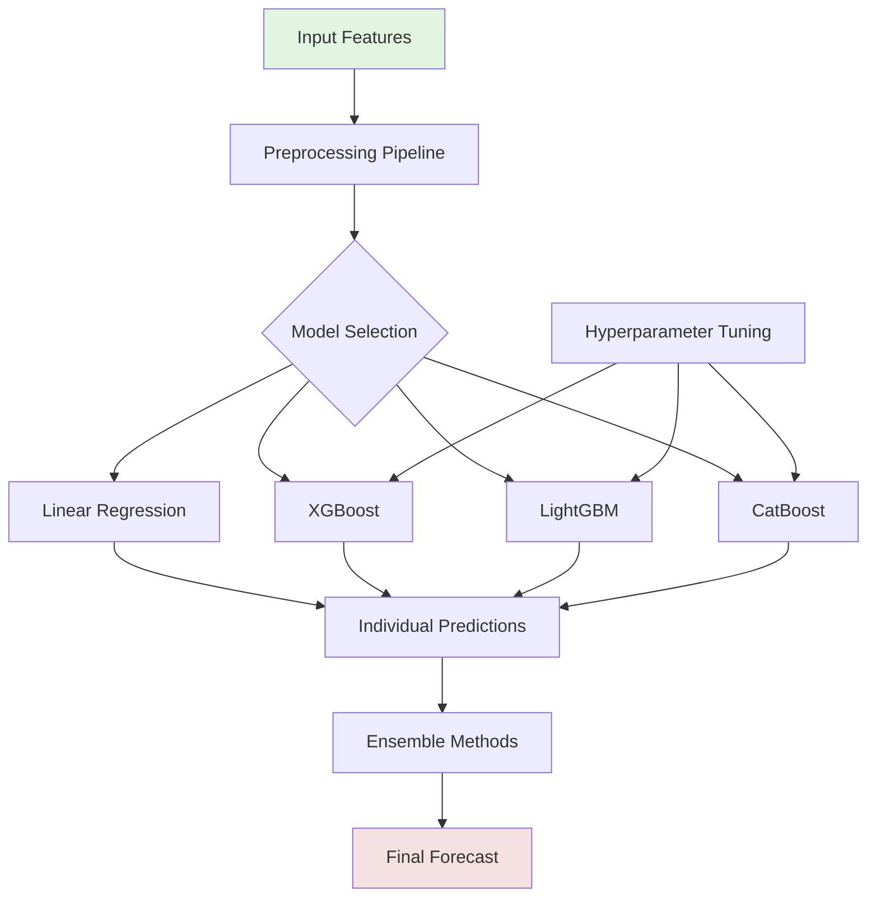
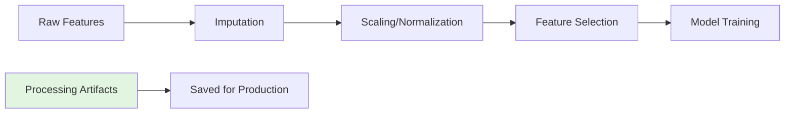
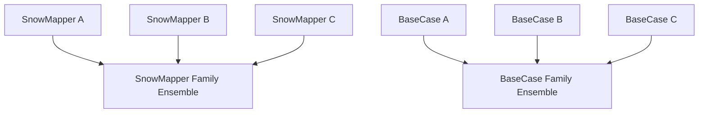
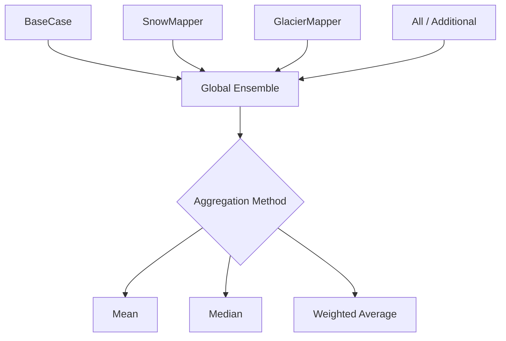
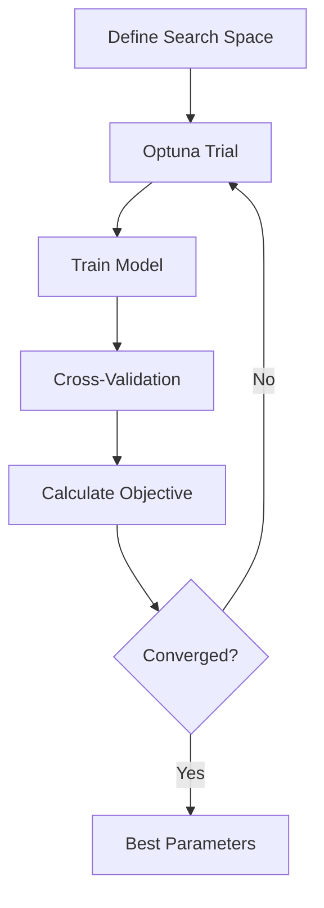

# Model Descriptions - Monthly Discharge Forecasting

This document provides detailed descriptions of the machine learning models implemented in the monthly discharge forecasting system.

## Model Architecture Overview



## Individual Model Descriptions

### 1. LINEAR_REGRESSION

**Type**: Statistical baseline model
**Implementation**: `lt_forecasting/forecast_models/LINEAR_REGRESSION.py`
**Class**: `LinearRegressionModel`

#### Training Strategy: Period-Specific Models

The Linear Regression model uses a **per-period training strategy** where a separate model is trained for each of the 36 periods (3 per month):

```python
For each period p in [1, 36]:
    1. Select data from period p across all years
    2. Compute feature-target correlations
    3. Select features with |correlation| > threshold
    4. Fit linear model: y = β₀ + β₁x₁ + ... + βₙxₙ
    5. Store period-specific coefficients and features
```

**Example**:
- Period 1 (Jan 1-10): May select snow features, temperature lags
- Period 18 (June 11-20): May emphasize precipitation, snowmelt indicators
- Period 36 (Dec 21-31): May focus on baseflow, temperature trends

**Training Process** (`calibrate_model_and_hindcast`):

1. **Leave-One-Year-Out Cross-Validation**:
   ```python
   for year in training_years:
       train_data = all_years_except(year)
       val_data = year
       for period in 1..36:
           model = fit_period_model(train_data[period])
           predictions[year, period] = model.predict(val_data[period])
   ```

2. **Final Model Training**:
   ```python
   for period in 1..36:
       model[period] = fit_on_all_data(period)
   ```

#### Key Features

- **Automatic Feature Selection**: Correlation-based selection per period
- **Period-Specific Models**: Different features/weights for each 10-day period
- **Multi-Basin Support**: Can train globally (all basins) or per-basin
- **No Preprocessing Required**: Direct regression without scaling/imputation
- **Real-time Retraining**: Model re-fitted on each call (no saved models)

#### Advantages

- ✅ Interpretable coefficients (β values show feature importance)
- ✅ Fast training and inference (<1 minute for all periods)
- ✅ Robust to small datasets (linear model assumptions)
- ✅ No hyperparameter tuning required
- ✅ Seasonal adaptation (period-specific features)

#### Limitations

- ❌ Cannot capture non-linear relationships
- ❌ Sensitive to multicollinearity between features
- ❌ Limited interaction modeling (no cross-feature terms)
- ❌ Assumes linear feature-target relationships

#### Configuration Parameters

```json
{
    "correlation_threshold": 0.3,     // Min |correlation| for feature selection
    "min_features": 1,                // Minimum features per period
    "max_features": 20,               // Maximum features per period
    "fit_intercept": true,            // Include intercept term
    "per_basin": false                // Train globally or per-basin
}
```

#### Use Cases

- **Baseline Model**: Establish performance floor for advanced models
- **Feature Importance**: Identify most predictive features per period
- **Rapid Prototyping**: Quick evaluation of feature engineering changes
- **Meta-Features**: Predictions used as inputs to ensemble models

### 2. SciRegressor (Tree-Based Models)

**Type**: Advanced gradient boosting models
**Implementation**: `lt_forecasting/forecast_models/SciRegressor.py`
**Class**: `SciRegressor`

#### Training Strategy: Global Model with Multi-Basin Data

The SciRegressor uses a **global training strategy** where a single model is trained on data from all basins:

```python
Global Model Approach:
1. Combine data from all basins into single dataset
2. Add basin identifier as categorical feature
3. Apply preprocessing (imputation, scaling, feature selection)
4. Train one model on all data
5. Model learns basin-specific patterns via basin_id feature
```

**Training Process** (`calibrate_model_and_hindcast`):

1. **Data Preprocessing**:
   ```python
   # Combine all basins
   data_combined = concat([basin1, basin2, ..., basinN])

   # Add basin identifier
   data_combined['basin_id'] = [1, 1, ..., 2, 2, ..., N, N]

   # Process features
   artifacts, X_train, y_train = process_training_data(data_combined)
   ```

2. **Leave-One-Year-Out Cross-Validation**:
   ```python
   for year in training_years:
       train_data = all_years_except(year)  # All basins
       val_data = year  # All basins

       model = fit_model(train_data)
       predictions[year] = model.predict(val_data)
   ```

3. **Final Model Training**:
   ```python
   model_final = fit_on_all_years(all_basins_data)
   save_model(model_final)
   save_artifacts(preprocessing_artifacts)
   ```

#### Supported Algorithms

##### a) XGBoost (Extreme Gradient Boosting)
- **Method**: Gradient boosted decision trees with L1/L2 regularization
- **Key Innovation**: Efficient sparse data handling, parallel tree construction
- **Best For**: High accuracy with moderate training time, robust performance
- **Typical Training Time**: 5-15 minutes (depends on data size)

##### b) LightGBM (Light Gradient Boosting Machine)
- **Method**: Gradient boosting with leaf-wise (best-first) tree growth
- **Key Innovation**: Histogram-based algorithms, faster training
- **Best For**: Large datasets with many features (>100k samples)
- **Typical Training Time**: 2-10 minutes (fastest of the three)

##### c) CatBoost (Categorical Boosting)
- **Method**: Gradient boosting with ordered boosting and oblivious trees
- **Key Innovation**: Native categorical feature handling, reduced overfitting
- **Best For**: Datasets with categorical variables (basin_id, month, etc.)
- **Typical Training Time**: 10-30 minutes (more conservative, thorough training)

#### Feature Processing Pipeline

SciRegressor uses the complete preprocessing pipeline from `FeatureProcessingArtifacts`:



**Pipeline Steps**:
1. **Imputation**: Fill missing values (mean/median strategy)
2. **Scaling**: StandardScaler or period-based normalization
3. **Feature Selection**: Remove low-variance and highly correlated features
4. **Save Artifacts**: Store all preprocessing objects for production

#### Key Features

- **Multi-Basin Learning**: Leverages data from all basins simultaneously
- **Artifact Persistence**: Preprocessing saved for consistent production inference
- **Linear Regression Meta-Features**: Can include LR predictions as additional features
- **Early Stopping**: Validation-based stopping to prevent overfitting
- **Relative Target Scaling**: Optional normalization of targets

#### Advantages

- ✅ Captures complex non-linear relationships
- ✅ Automatic interaction detection (tree splits)
- ✅ Robust to outliers and missing data
- ✅ Feature importance rankings
- ✅ State-of-the-art performance on tabular data
- ✅ Handles mixed data types (numerical + categorical)

#### Limitations

- ❌ Requires more training data than linear models (>1000 samples recommended)
- ❌ Hyperparameter sensitive (requires tuning)
- ❌ Less interpretable than linear models (black box)
- ❌ Longer training time (minutes vs seconds)
- ❌ May overfit without proper regularization

**Key Hyperparameters**:
```json
{
    "xgboost": {
        "n_estimators": 500,
        "max_depth": 6,
        "learning_rate": 0.01,
        "subsample": 0.8,
        "colsample_bytree": 0.8,
        "gamma": 0,
        "reg_alpha": 0,
        "reg_lambda": 1
    },
    "lightgbm": {
        "n_estimators": 500,
        "num_leaves": 31,
        "learning_rate": 0.01,
        "feature_fraction": 0.8,
        "bagging_fraction": 0.8,
        "bagging_freq": 5,
        "min_child_samples": 20
    },
    "catboost": {
        "iterations": 500,
        "depth": 6,
        "learning_rate": 0.01,
        "l2_leaf_reg": 3,
        "border_count": 128,
        "feature_border_type": "Median"
    }
}
```

#### Use Cases

- **Primary Forecasting**: Main operational model for most basins
- **Ensemble Member**: Combine with other models for improved accuracy
- **Feature Importance Analysis**: Understand driver variables
- **Transfer Learning**: Basin_id feature enables knowledge sharing across basins

---

### 3. UncertaintyMixtureModel (Meta-Learning with MDN)

**Type**: Deep learning meta-model with uncertainty quantification
**Implementation**: `lt_forecasting/forecast_models/deep_models/uncertainty_mixture.py`
**Class**: `UncertaintyMixtureModel`

#### Training Strategy: Meta-Learning on Base Model Errors

The Uncertainty Mixture Model uses a **meta-learning approach** where it learns to combine predictions from multiple base models (Linear Regression, XGBoost, LightGBM, CatBoost) and quantify uncertainty:

```python
Meta-Learning Architecture:
1. Collect LOO-CV predictions from all base models
2. Compute prediction errors: error = prediction - ground_truth
3. Extract error statistics (mean, std, quantiles) per basin/period
4. Train Deep Learnign model to model error distribution
5. Use UMM to adjust predictions and generate uncertainty intervals
```

**Training Process** (`calibrate_model_and_hindcast`):

1. **Load Base Model Predictions**:
   ```python
   base_models = ['LR', 'XGB', 'LGBM', 'CatBoost']
   predictions = load_loo_predictions(base_models)
   ground_truth = load_observations()
   ```

2. **Compute Error Statistics**:
   ```python
   errors = predictions - ground_truth
   error_stats = compute_statistics_per_basin_period(errors)
   # Stats: mean, std, quantiles (5th, 10th, 50th, 90th, 95th)
   ```

3. **Prepare Meta-Features**:
   ```python
   meta_features = [
       predictions_model1,
       predictions_model2,
       ...,
       predictions_modelN,
       temporal_features (day_of_year_sin, day_of_year_cos),
       basin_characteristics
   ]
   ```

4. **Train Mixture Density Network**:
   ```python
   mdn = MixtureDensityNetwork(
       input_size=len(meta_features),
       hidden_size=128,
       num_components=5,  # Number of Gaussian components
       loss_fn=AsymmetricLaplaceLoss()
   )

   trainer = pl.Trainer(
       max_epochs=500,
       early_stopping=True,
       patience=20
   )

   trainer.fit(mdn, train_dataloader, val_dataloader)
   ```

5. **Generate Predictions with Uncertainty**:
   ```python
   # MDN outputs distribution parameters
   loc, scale, asymmetry = mdn.predict(meta_features)

   # Sample from mixture distribution
   Q_mean = weighted_mean(means, weights)
   Q_05 = percentile(distribution, 0.05)
   Q_50 = percentile(distribution, 0.50)  # Median
   Q_95 = percentile(distribution, 0.95)
   ```

#### Architecture: Mixture Density Network (MDN)

The MDN models the prediction error distribution as a Asymetric Laplace Distribution:

```
P(error | base_predictions) = ALD_Network(x)
```


**Network Structure**:
```python
Input (base predictions + temporal features)
    ↓
Residual Blocks (configurable depth)
    ↓
Hidden Layer (128-256 units, dropout 0.1-0.3)
    ↓
Output Heads:
    - Means: num_components values
    - Stds: num_components positive values (log-transform)
    - Weights: num_components probabilities (softmax)
```

#### Loss Function: Asymmetric Laplace Loss

The model uses asymmetric Laplace loss to handle skewed error distributions common in hydrology:

```python
L(y, ŷ, τ) = {
    τ · |y - ŷ|        if y ≥ ŷ
    (1-τ) · |y - ŷ|    if y < ŷ
}
```

**Advantages**:
- Different penalties for over-prediction vs under-prediction
- Suitable for quantile regression
- Captures asymmetric uncertainty (e.g., flood peaks)

#### Key Features

- **Uncertainty Quantification**: Probabilistic forecasts with prediction intervals
- **Meta-Learning**: Learns from strengths/weaknesses of base models
- **Temporal Awareness**: Incorporates seasonal patterns in error modeling
- **Multi-Model Fusion**: Optimally combines diverse model types
- **Asymmetric Loss**: Better handles skewed discharge distributions

#### Advantages

- ✅ Provides prediction intervals (quantiles: 5%, 10%, 50%, 90%, 95%)
- ✅ Learns complex relationships between base model predictions
- ✅ Captures non-stationary uncertainty (seasonal variation)
- ✅ Often improves upon best individual model
- ✅ Identifies when/where models are most uncertain

#### Limitations

- ❌ Requires pre-trained base models (dependency)
- ❌ More complex to train and debug (deep learning)
- ❌ Longer training time (30-60 minutes)
- ❌ Requires careful hyperparameter tuning
- ❌ May not generalize well with limited data (<500 samples)

#### Configuration Parameters

```json
{
    "hidden_size": 128,              // Hidden layer neurons
    "num_residual_blocks": 2,        // Depth of residual network
    "dropout": 0.2,                  // Dropout rate for regularization
    "learning_rate": 0.001,          // Adam optimizer learning rate
    "batch_size": 64,                // Batch size for training
    "max_epochs": 500,               // Maximum training epochs
    "patience": 20,                  // Early stopping patience
    "weight_decay": 1e-5,            // L2 regularization
    "gradient_clip_val": 1.0,        // Gradient clipping threshold
    "num_components": 5,             // Gaussian mixture components
    "quantiles": [0.05, 0.1, 0.5, 0.9, 0.95]  // Output quantiles
}
```

#### Use Cases

- **Uncertainty Quantification**: When prediction intervals are critical (e.g., flood warnings)
- **Risk Assessment**: Decision-making under uncertainty
- **Ensemble Method**: Meta-learning combination of diverse models
- **Model Comparison**: Understand relative model performance across conditions

#### Output Format

```csv
date,Q_mean,Q_05,Q_10,Q_50,Q_90,Q_95,valid_from,valid_to
2024-06-01,150.2,120.5,130.8,148.6,170.4,185.3,2024-06-01,2024-06-30
```

**Interpretation**:
- `Q_mean`: Expected discharge (mean of mixture distribution)
- `Q_50`: Median forecast (50th percentile)
- `Q_05`, `Q_95`: 90% prediction interval
- `Q_10`, `Q_90`: 80% prediction interval

---

## Ensemble Methods

### Family Ensembles
Combine multiple models of the same type (e.g., all XGBoost models with different hyperparameters):



### Global Ensemble
Combines predictions from all available models:



**Aggregation Methods**:
1. **Simple Mean**: Equal weight to all models
2. **Median**: Robust to outlier predictions
3. **Weighted Average**: Performance-based weights (future)
4. **Stacking**: Meta-model learns optimal combination (future)

## Feature Importance Analysis

### Linear Regression
- Coefficient magnitudes indicate feature importance
- Sign indicates direction of relationship
- Period-specific importance varies seasonally

### Tree-Based Models
- **Gain**: Total reduction in loss from splits on feature
- **Split Count**: Number of times feature used in trees
- **Permutation**: Performance drop when feature shuffled

Example importance extraction:
```python
# XGBoost
importance = model.get_booster().get_score(importance_type='gain')

# LightGBM
importance = model.feature_importance(importance_type='gain')

# CatBoost
importance = model.get_feature_importance()
```

## Hyperparameter Optimization

### Optimization Strategy
Using Optuna for Bayesian optimization:



### Key Parameters to Optimize

**Tree Depth/Leaves**:
- Controls model complexity
- Deeper = more complex patterns
- Risk of overfitting with very deep trees

**Learning Rate**:
- Step size for gradient descent
- Lower = more robust but slower
- Typically 0.001 - 0.3

**Regularization**:
- L1 (Lasso): Feature selection
- L2 (Ridge): Prevent large coefficients
- Tree-specific: min samples, gamma

**Sampling**:
- Feature sampling: random subsets of features
- Row sampling: random subsets of data
- Helps prevent overfitting

## Model Persistence and Deployment

### Saving Models
The Forecasting model save the relevant models and objects directly into their directory (where the config is defined). 

### Loading for Production
The Forecast model classes save the relevant objects directly in the directory, where their confifuration is saved. For the Linear Regression, the model gets refitted each time - nothing gets scaled. For the SciRegressor each model gets saved as a.joblib file and the scalers and pre-processing objects are saved via the Artifacts pipeline.

## Performance Monitoring

### Key Metrics to Track
1. **Training Metrics**: Loss convergence, training time
2. **Validation Metrics**: Cross-validation scores
3. **Test Metrics**: Hold-out set performance
4. **Production Metrics**: Real-time prediction accuracy

### Model Drift Detection
- Monitor performance over time
- Compare recent vs. historical metrics
- Retrain when performance degrades

## Best Practices

1. **Start Simple**: Begin with BaseCase family for baseline
2. **Incremental Complexity**: Add snow/glacier features only if they improve performance significantly
3. **Data Quality First**: Better to use simpler models with good data than complex models with poor data
4. **Family Ensembles**: Combine models within families before global ensembling
5. **Cross-Validation**: Always use proper temporal validation strategy
6. **Feature Engineering**: Often more impactful than model choice
7. **Monitor Performance**: Track family-specific metrics in production
8. **Regular Retraining**: Update models with new data, especially for snow/glacier features
9. **Document Experiments**: Track what works for each basin type