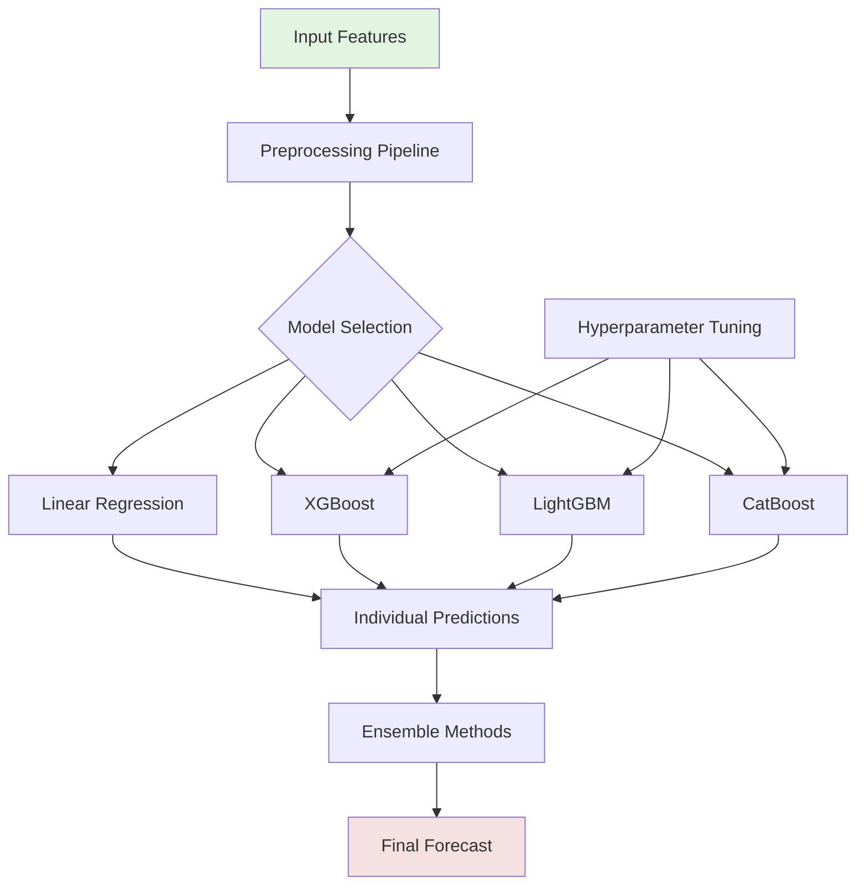
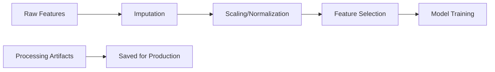
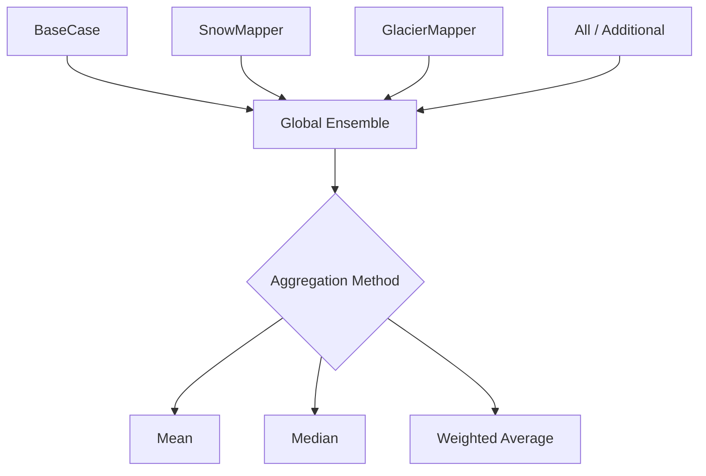
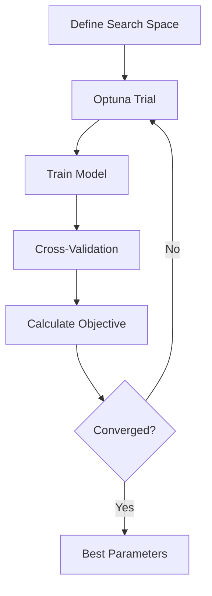
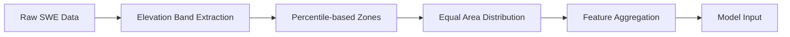
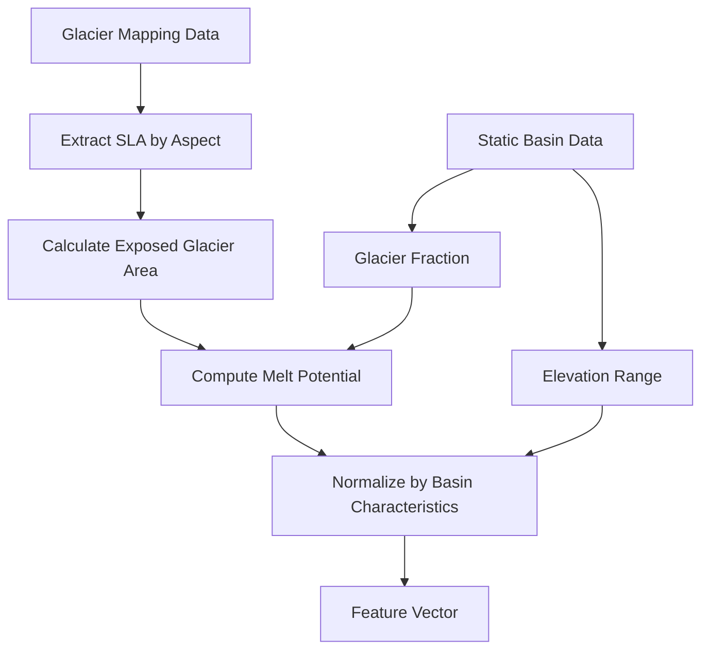
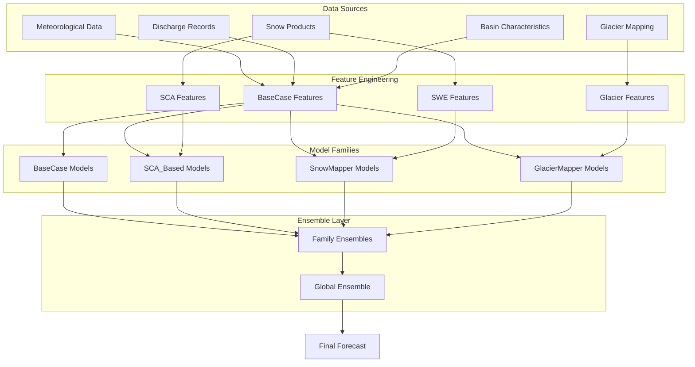

# Model Descriptions - Monthly Discharge Forecasting

This document provides detailed descriptions of the machine learning models implemented in the monthly discharge forecasting system.

## Model Architecture Overview



## Individual Model Descriptions

### 1. LINEAR_REGRESSION

**Type**: Statistical baseline model

**Key Features**:
- Simple linear regression with automatic feature selection
- Period-specific models (36 periods = 3 per month)
- Correlation-based feature selection per period
- Basin-specific or global fitting options

**Architecture**:
```python
For each period p in [1, 36]:
    1. Select features with |correlation| > threshold
    2. Fit linear model: y = β₀ + β₁x₁ + ... + βₙxₙ
    3. Store coefficients and selected features
```

**Advantages**:
- Interpretable coefficients
- Fast training and inference
- Robust to small datasets
- No hyperparameter tuning required

**Limitations**:
- Cannot capture non-linear relationships
- Sensitive to multicollinearity
- Limited interaction modeling

**Configuration Parameters**:
```json
{
    "correlation_threshold": 0.3,
    "min_features": 1,
    "max_features": 20,
    "fit_intercept": true
}
```

### 2. SciRegressor (Ensemble Tree Models)

**Type**: Advanced gradient boosting models

**Supported Algorithms**:

#### a) XGBoost (Extreme Gradient Boosting)
- **Method**: Gradient boosted decision trees with regularization
- **Key Innovation**: Efficient handling of sparse data and parallel processing
- **Best For**: High accuracy with moderate training time

#### b) LightGBM (Light Gradient Boosting Machine)
- **Method**: Gradient boosting with leaf-wise tree growth
- **Key Innovation**: Faster training through histogram-based algorithms
- **Best For**: Large datasets with many features

#### c) CatBoost (Categorical Boosting)
- **Method**: Gradient boosting with ordered boosting
- **Key Innovation**: Native handling of categorical features
- **Best For**: Datasets with categorical variables

**Common Architecture**:
```python
Global Model Approach:
1. Combine data from all basins
2. Add basin identifier as feature
3. Train single model on combined data
4. Use basin-specific features during prediction
```

**Feature Processing Pipeline**:


**Advantages**:
- Captures complex non-linear relationships
- Handles interactions automatically
- Robust to outliers
- Feature importance rankings
- State-of-the-art performance

**Limitations**:
- Requires more training data
- Hyperparameter sensitive
- Less interpretable than linear models
- Longer training time

**Key Hyperparameters**:
```json
{
    "xgboost": {
        "n_estimators": 500,
        "max_depth": 6,
        "learning_rate": 0.01,
        "subsample": 0.8,
        "colsample_bytree": 0.8,
        "gamma": 0,
        "reg_alpha": 0,
        "reg_lambda": 1
    },
    "lightgbm": {
        "n_estimators": 500,
        "num_leaves": 31,
        "learning_rate": 0.01,
        "feature_fraction": 0.8,
        "bagging_fraction": 0.8,
        "bagging_freq": 5,
        "min_child_samples": 20
    },
    "catboost": {
        "iterations": 500,
        "depth": 6,
        "learning_rate": 0.01,
        "l2_leaf_reg": 3,
        "border_count": 128,
        "feature_border_type": "Median"
    }
}
```

## Ensemble Methods

### Family Ensembles
Combine multiple models of the same type (e.g., all XGBoost models with different hyperparameters):

```mermaid
graph TD
    A[SnowMapper A (xgb, lgbm, catboost)] --> D[SnowMapper Family Ensemble (n=9)]
    B[SnowMapper B (linear regression)] --> D
    C[SnowMapper C (...)] --> D
    
    E[BaseCase A (xgb, lgbm, catboost)] --> H[BaseCase Family Ensemble]
    F[BaseCase B (linear regression)] --> H
    G[BaseCase C (..)] --> H
```

### Global Ensemble
Combines predictions from all available models:



**Aggregation Methods**:
1. **Simple Mean**: Equal weight to all models
2. **Median**: Robust to outlier predictions
3. **Weighted Average**: Performance-based weights (future)
4. **Stacking**: Meta-model learns optimal combination (future)

## Feature Importance Analysis

### Linear Regression
- Coefficient magnitudes indicate feature importance
- Sign indicates direction of relationship
- Period-specific importance varies seasonally

### Tree-Based Models
- **Gain**: Total reduction in loss from splits on feature
- **Split Count**: Number of times feature used in trees
- **Permutation**: Performance drop when feature shuffled

Example importance extraction:
```python
# XGBoost
importance = model.get_booster().get_score(importance_type='gain')

# LightGBM
importance = model.feature_importance(importance_type='gain')

# CatBoost
importance = model.get_feature_importance()
```

## Hyperparameter Optimization

### Optimization Strategy
Using Optuna for Bayesian optimization:



### Key Parameters to Optimize

**Tree Depth/Leaves**:
- Controls model complexity
- Deeper = more complex patterns
- Risk of overfitting with very deep trees

**Learning Rate**:
- Step size for gradient descent
- Lower = more robust but slower
- Typically 0.001 - 0.3

**Regularization**:
- L1 (Lasso): Feature selection
- L2 (Ridge): Prevent large coefficients
- Tree-specific: min samples, gamma

**Sampling**:
- Feature sampling: random subsets of features
- Row sampling: random subsets of data
- Helps prevent overfitting

## Model Persistence and Deployment

### Saving Models
```python
# Save model
model.save_model('model.pkl')

# Save preprocessing artifacts
artifacts.save('artifacts.pkl')

# Save configuration
json.dump(config, 'config.json')
```

### Loading for Production
```python
# Load components
model = load_model('model.pkl')
artifacts = load_artifacts('artifacts.pkl')
config = load_config('config.json')

# Process new data
features = artifacts.transform(new_data)
predictions = model.predict(features)
```

## Performance Monitoring

### Key Metrics to Track
1. **Training Metrics**: Loss convergence, training time
2. **Validation Metrics**: Cross-validation scores
3. **Test Metrics**: Hold-out set performance
4. **Production Metrics**: Real-time prediction accuracy

### Model Drift Detection
- Monitor performance over time
- Compare recent vs. historical metrics
- Retrain when performance degrades

<<<<<<< Updated upstream
=======
## Model Families

The monthly forecasting system organizes models into four main families based on their input features and data sources:

### 1. BaseCase Family

**Description**: Models using basic hydrometeorological features without snow or glacier data.

**Models in Family**:
- `LR_Q_T_P`: Linear regression with discharge, temperature, and precipitation
- `PerBasinScalingLR`: Linear regression with basin-specific scaling
- `ShortTermLR`: Focuses on recent temporal patterns
- `ShortTerm_Features`: Enhanced short-term feature engineering
- `NormBased`: Normalized feature approach

**Core Features**:
- Historical discharge (Q) with various lag windows
- Temperature (T) aggregates (mean, sum, anomalies)
- Precipitation (P) aggregates (sum, cumulative)
- Temporal features (month, season, cyclical encodings)
- Basin-specific characteristics (area, elevation)

**Use Cases**:
- Basins with limited snow/glacier influence
- Quick baseline predictions
- Areas with good meteorological data coverage

### 2. SCA_Based Family

**Description**: Models incorporating Snow Covered Area (SCA) data from remote sensing.

**Models in Family**:
- `LR_Q_SCA`: Linear regression with discharge and snow cover
- `LR_Q_T_SCA`: Adds temperature to capture melt dynamics

**Core Features**:
- All BaseCase features
- Snow Covered Area (SCA) percentage
- SCA change rates
- Temperature-SCA interaction terms
- Elevation-based SCA distribution

**Use Cases**:
- Snow-dominated basins
- Spring melt forecasting
- Areas with good satellite coverage

### 3. SnowMapper_Based Family

**Description**: Advanced models using detailed snow water equivalent (SWE) data.

**Models in Family**:
- `LR_Q_SWE`: Basic SWE-based prediction
- `LR_Q_SWE_T`: SWE with temperature interactions
- `LR_Q_T_P_SWE`: Full feature set with SWE
- `LR_Q_dSWEdt_T_P`: Includes SWE change rates
- `LongTermLR`: Long-term patterns with snow data
- `ShortTermLR`: Short-term snow dynamics
- `ShortTerm_Features`: Enhanced snow feature engineering
- `NormBased`: Normalized snow features

**Core Features**:
- All BaseCase features
- Snow Water Equivalent (SWE) by elevation zones
- SWE change rates (dSWE/dt)
- Elevation-distributed snow features:
  ```python
  # Example: 5 elevation zones
  SWE_elev_zone_1, SWE_elev_zone_2, ..., SWE_elev_zone_5
  ```
- Snow melt potential indices
- Temperature-SWE interactions

**Feature Processing**:


**Use Cases**:
- High-altitude basins
- Detailed snowmelt modeling
- Seasonal water resource planning

### 4. GlacierMapper_Based Family

**Description**: Specialized models for glacier-influenced basins using glacier mapping data.

**Models in Family**:
- `NormBased`: Normalized glacier features
- `Correction`: Glacier melt correction models
- `MiniCorrection`: Simplified glacier adjustments

**Core Features**:
- All SnowMapper features (when available)
- Glacier-specific features:
  - Snow Line Altitude (SLA) by aspect:
    ```python
    SLA_East, SLA_West, SLA_North, SLA_South, SLA_Avr
    ```
  - Glacier area below snowline (`gla_area_below_sl50`)
  - Glacier fractional snow cover (`gla_fsc_total`, `gla_fsc_below_sl50`)
  - Basin fractional snow cover (`fsc_basin`)
  - Glacier melt potential:
    ```python
    glacier_melt_potential = (100 - gla_fsc_total) * glacier_fraction
    ```
- Normalized SLA values:
  ```python
  SLA_norm = (SLA - h_min) / (h_max - h_min)
  ```

**Feature Engineering Pipeline**:


**Use Cases**:
- Heavily glacierized basins
- Long-term climate impact studies
- High-altitude water resource management


## Feature Engineering Details

### Temporal Feature Windows

All families use configurable temporal windows for feature aggregation:

```python
feature_config = {
    "discharge": [
        {"operation": "mean", "windows": [7, 15, 30], "lags": {7: [7, 14]}},
        {"operation": "diff", "windows": [30], "lags": {}},
        {"operation": "slope", "windows": [15, 30], "lags": {}}
    ],
    "temperature": [
        {"operation": "mean", "windows": [10, 20, 30], "lags": {}},
        {"operation": "sum", "windows": [30, 60], "lags": {}}
    ],
    "precipitation": [
        {"operation": "sum", "windows": [30, 60, 90], "lags": {}},
        {"operation": "cumsum", "windows": [180], "lags": {}}
    ]
}
```

### Snow/Glacier Feature Processing

**Elevation Zone Distribution**:
```python
def calculate_percentile_snow_bands(df, elevation_shp, num_bands=5):
    """
    Distribute snow variables across equal-area elevation bands
    """
    # Calculate area percentiles
    percentiles = np.linspace(0, 100, num_bands + 1)
    
    # Assign snow values to bands
    for band in range(num_bands):
        zone_mask = (elevation >= percentiles[band]) & 
                    (elevation < percentiles[band + 1])
        df[f'SWE_zone_{band+1}'] = aggregate_snow_in_zone(zone_mask)
```


## Data Flow Architecture




>>>>>>> Stashed changes
## Best Practices

1. **Start Simple**: Begin with BaseCase family for baseline
2. **Incremental Complexity**: Add snow/glacier features only if they improve performance significantly
3. **Data Quality First**: Better to use simpler models with good data than complex models with poor data
4. **Family Ensembles**: Combine models within families before global ensembling
5. **Cross-Validation**: Always use proper temporal validation strategy
6. **Feature Engineering**: Often more impactful than model choice
7. **Monitor Performance**: Track family-specific metrics in production
8. **Regular Retraining**: Update models with new data, especially for snow/glacier features
9. **Document Experiments**: Track what works for each basin type