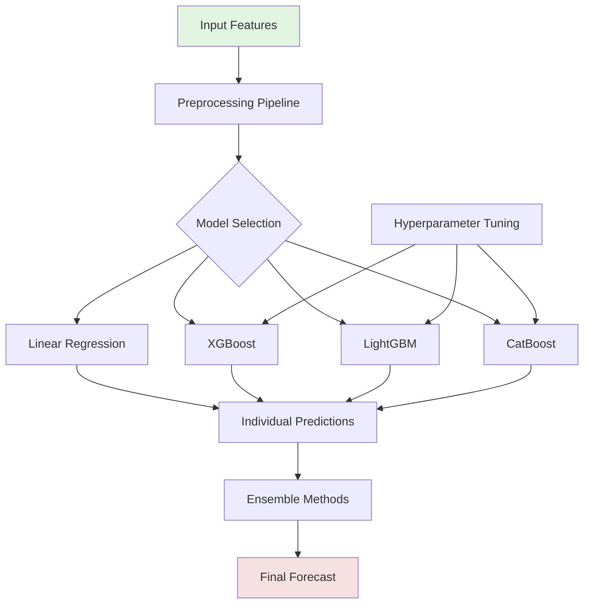
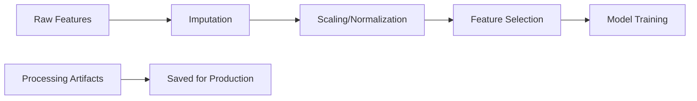
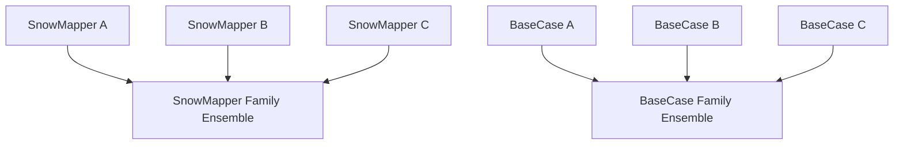
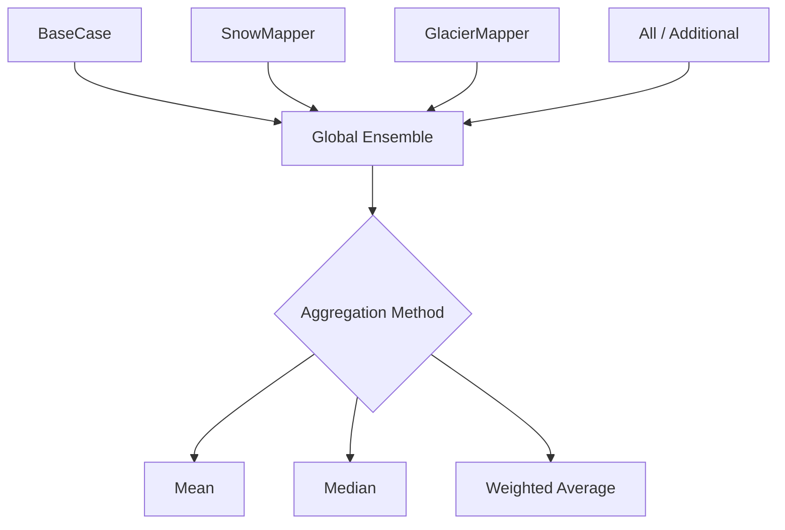
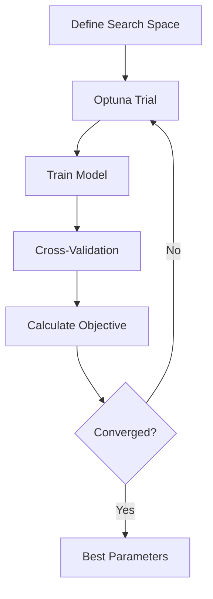

# Model Descriptions - Monthly Discharge Forecasting

This document provides detailed descriptions of the machine learning models implemented in the monthly discharge forecasting system.

## Model Architecture Overview



## Individual Model Descriptions

### 1. LINEAR_REGRESSION

**Type**: Statistical baseline model

**Key Features**:
- Simple linear regression with automatic feature selection
- Period-specific models (36 periods = 3 per month)
- Correlation-based feature selection per period
- Basin-specific or global fitting options

**Architecture**:
```python
For each period p in [1, 36]:
    1. Select features with |correlation| > threshold
    2. Fit linear model: y = β₀ + β₁x₁ + ... + βₙxₙ
    3. Store coefficients and selected features
```

**Advantages**:
- Interpretable coefficients
- Fast training and inference
- Robust to small datasets
- No hyperparameter tuning required

**Limitations**:
- Cannot capture non-linear relationships
- Sensitive to multicollinearity
- Limited interaction modeling

**Configuration Parameters**:
```json
{
    "correlation_threshold": 0.3,
    "min_features": 1,
    "max_features": 20,
    "fit_intercept": true
}
```

### 2. SciRegressor (Ensemble Tree Models)

**Type**: Advanced gradient boosting models

**Supported Algorithms**:

#### a) XGBoost (Extreme Gradient Boosting)
- **Method**: Gradient boosted decision trees with regularization
- **Key Innovation**: Efficient handling of sparse data and parallel processing
- **Best For**: High accuracy with moderate training time

#### b) LightGBM (Light Gradient Boosting Machine)
- **Method**: Gradient boosting with leaf-wise tree growth
- **Key Innovation**: Faster training through histogram-based algorithms
- **Best For**: Large datasets with many features

#### c) CatBoost (Categorical Boosting)
- **Method**: Gradient boosting with ordered boosting
- **Key Innovation**: Native handling of categorical features
- **Best For**: Datasets with categorical variables

**Common Architecture**:
```python
Global Model Approach:
1. Combine data from all basins
2. Add basin identifier as feature
3. Train single model on combined data
4. Use basin-specific features during prediction
```

**Feature Processing Pipeline**:


**Advantages**:
- Captures complex non-linear relationships
- Handles interactions automatically
- Robust to outliers
- Feature importance rankings
- State-of-the-art performance

**Limitations**:
- Requires more training data
- Hyperparameter sensitive
- Less interpretable than linear models
- Longer training time

**Key Hyperparameters**:
```json
{
    "xgboost": {
        "n_estimators": 500,
        "max_depth": 6,
        "learning_rate": 0.01,
        "subsample": 0.8,
        "colsample_bytree": 0.8,
        "gamma": 0,
        "reg_alpha": 0,
        "reg_lambda": 1
    },
    "lightgbm": {
        "n_estimators": 500,
        "num_leaves": 31,
        "learning_rate": 0.01,
        "feature_fraction": 0.8,
        "bagging_fraction": 0.8,
        "bagging_freq": 5,
        "min_child_samples": 20
    },
    "catboost": {
        "iterations": 500,
        "depth": 6,
        "learning_rate": 0.01,
        "l2_leaf_reg": 3,
        "border_count": 128,
        "feature_border_type": "Median"
    }
}
```

## Ensemble Methods

### Family Ensembles
Combine multiple models of the same type (e.g., all XGBoost models with different hyperparameters):



### Global Ensemble
Combines predictions from all available models:



**Aggregation Methods**:
1. **Simple Mean**: Equal weight to all models
2. **Median**: Robust to outlier predictions
3. **Weighted Average**: Performance-based weights (future)
4. **Stacking**: Meta-model learns optimal combination (future)

## Feature Importance Analysis

### Linear Regression
- Coefficient magnitudes indicate feature importance
- Sign indicates direction of relationship
- Period-specific importance varies seasonally

### Tree-Based Models
- **Gain**: Total reduction in loss from splits on feature
- **Split Count**: Number of times feature used in trees
- **Permutation**: Performance drop when feature shuffled

Example importance extraction:
```python
# XGBoost
importance = model.get_booster().get_score(importance_type='gain')

# LightGBM
importance = model.feature_importance(importance_type='gain')

# CatBoost
importance = model.get_feature_importance()
```

## Hyperparameter Optimization

### Optimization Strategy
Using Optuna for Bayesian optimization:



### Key Parameters to Optimize

**Tree Depth/Leaves**:
- Controls model complexity
- Deeper = more complex patterns
- Risk of overfitting with very deep trees

**Learning Rate**:
- Step size for gradient descent
- Lower = more robust but slower
- Typically 0.001 - 0.3

**Regularization**:
- L1 (Lasso): Feature selection
- L2 (Ridge): Prevent large coefficients
- Tree-specific: min samples, gamma

**Sampling**:
- Feature sampling: random subsets of features
- Row sampling: random subsets of data
- Helps prevent overfitting

## Model Persistence and Deployment

### Saving Models
The Forecasting model save the relevant models and objects directly into their directory (where the config is defined). 

### Loading for Production
The Forecast model classes save the relevant objects directly in the directory, where their confifuration is saved. For the Linear Regression, the model gets refitted each time - nothing gets scaled. For the SciRegressor each model gets saved as a.joblib file and the scalers and pre-processing objects are saved via the Artifacts pipeline.

## Performance Monitoring

### Key Metrics to Track
1. **Training Metrics**: Loss convergence, training time
2. **Validation Metrics**: Cross-validation scores
3. **Test Metrics**: Hold-out set performance
4. **Production Metrics**: Real-time prediction accuracy

### Model Drift Detection
- Monitor performance over time
- Compare recent vs. historical metrics
- Retrain when performance degrades

## Best Practices

1. **Start Simple**: Begin with BaseCase family for baseline
2. **Incremental Complexity**: Add snow/glacier features only if they improve performance significantly
3. **Data Quality First**: Better to use simpler models with good data than complex models with poor data
4. **Family Ensembles**: Combine models within families before global ensembling
5. **Cross-Validation**: Always use proper temporal validation strategy
6. **Feature Engineering**: Often more impactful than model choice
7. **Monitor Performance**: Track family-specific metrics in production
8. **Regular Retraining**: Update models with new data, especially for snow/glacier features
9. **Document Experiments**: Track what works for each basin type